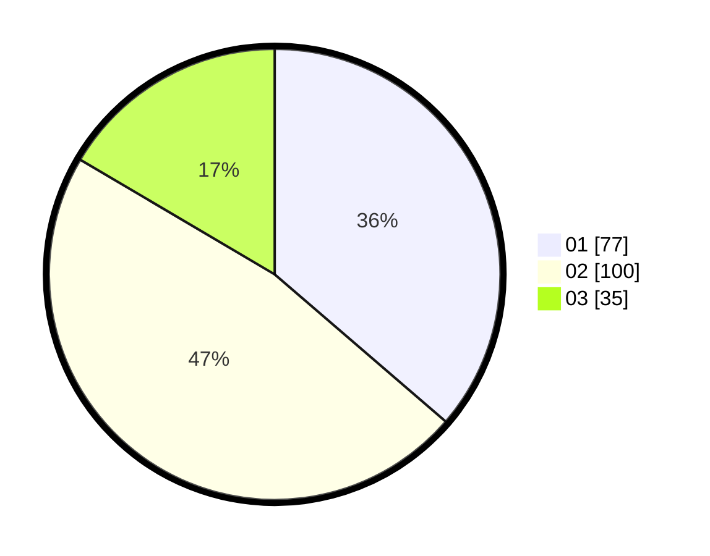

# Hasil

Hasil perolehan suara paslon dapat dilihat pada file paslon-01.txt, paslon-02.txt, dan paslon-03.txt.

Jika tidak ada, artinya data tersebut belum ada pada SIREKAP.

## Perolehan Suara

 * Paslon 01: **77**.
 * Paslon 02: **100**.
 * Paslon 03: **35**.

## Foto C Plano

https://sirekap-obj-formc.kpu.go.id/6461/pemilu/ppwp/31/74/07/10/10/3174071010022-20240214-195644--ee620d98-c871-4d46-bb3f-c6d69e37d014.jpg

https://sirekap-obj-formc.kpu.go.id/6461/pemilu/ppwp/31/74/07/10/10/3174071010022-20240214-195700--5df98785-f431-4d58-94e2-8544c4d8dd55.jpg

https://sirekap-obj-formc.kpu.go.id/6461/pemilu/ppwp/31/74/07/10/10/3174071010022-20240214-195710--8601a1ed-2fb7-4e54-97c9-bc1bf9132989.jpg

## DATA PEMILIH TETAP

Jumlah pemilih dalam DPT: **264**.
 * L: **140**.
 * P: **124**.

## DATA PENGGUNA HAK PILIH

Jumlah pengguna hak pilih dalam DPT: **213**.
 * L: **106**.
 * P: **107**.

Jumlah pengguna hak pilih dalam DPTb: **2**.
 * L: **1**.
 * P: **1**.

Jumlah pengguna hak pilih dalam DPK: **2**.
 * L: **0**.
 * P: **2**.

Jumlah pengguna hak pilih: **217**.
 * L: **107**.
 * P: **110**.

## JUMLAH SUARA SAH DAN TIDAK SAH

JUMLAH SELURUH SUARA SAH: **212**.

JUMLAH SUARA TIDAK SAH: **5**.

JUMLAH SELURUH SUARA SAH DAN SUARA TIDAK SAH: **217**.
