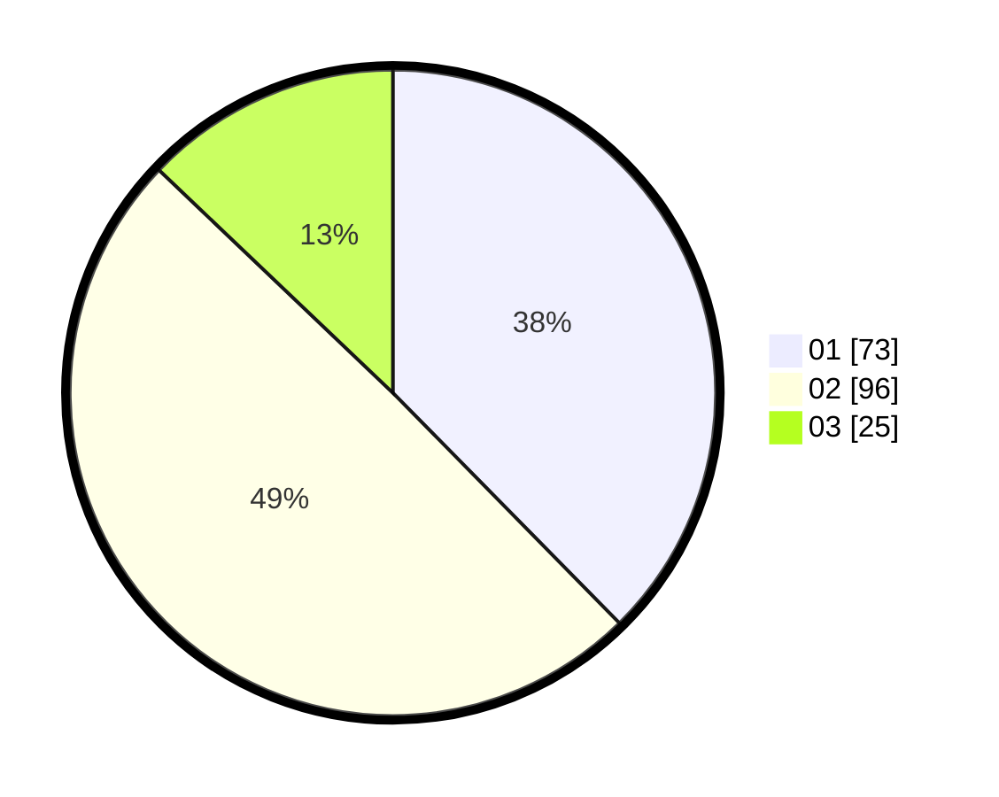

# Hasil

Hasil perolehan suara paslon dapat dilihat pada file paslon-01.txt, paslon-02.txt, dan paslon-03.txt.

Jika tidak ada, artinya data tersebut belum ada pada SIREKAP.

## Perolehan Suara

 * Paslon 01: **73**.
 * Paslon 02: **96**.
 * Paslon 03: **25**.

## Foto C Plano

https://sirekap-obj-formc.kpu.go.id/2baf/pemilu/ppwp/31/74/07/10/10/3174071010075-20240214-141026--64fd4434-ada5-446d-a68f-7f600419f80b.jpg

https://sirekap-obj-formc.kpu.go.id/2baf/pemilu/ppwp/31/74/07/10/10/3174071010075-20240214-141838--ee954b23-9fb2-4ec9-b13b-f204d81bbefc.jpg

https://sirekap-obj-formc.kpu.go.id/2baf/pemilu/ppwp/31/74/07/10/10/3174071010075-20240215-015713--96cf8fb8-a0a0-4140-9493-8676d7749a51.jpg

## DATA PEMILIH TETAP

Jumlah pemilih dalam DPT: **234**.
 * L: **106**.
 * P: **128**.

## DATA PENGGUNA HAK PILIH

Jumlah pengguna hak pilih dalam DPT: **190**.
 * L: **83**.
 * P: **107**.

Jumlah pengguna hak pilih dalam DPTb: **3**.
 * L: **2**.
 * P: **1**.

Jumlah pengguna hak pilih dalam DPK: **5**.
 * L: **2**.
 * P: **3**.

Jumlah pengguna hak pilih: **198**.
 * L: **87**.
 * P: **111**.

## JUMLAH SUARA SAH DAN TIDAK SAH

JUMLAH SELURUH SUARA SAH: **194**.

JUMLAH SUARA TIDAK SAH: **4**.

JUMLAH SELURUH SUARA SAH DAN SUARA TIDAK SAH: **198**.
