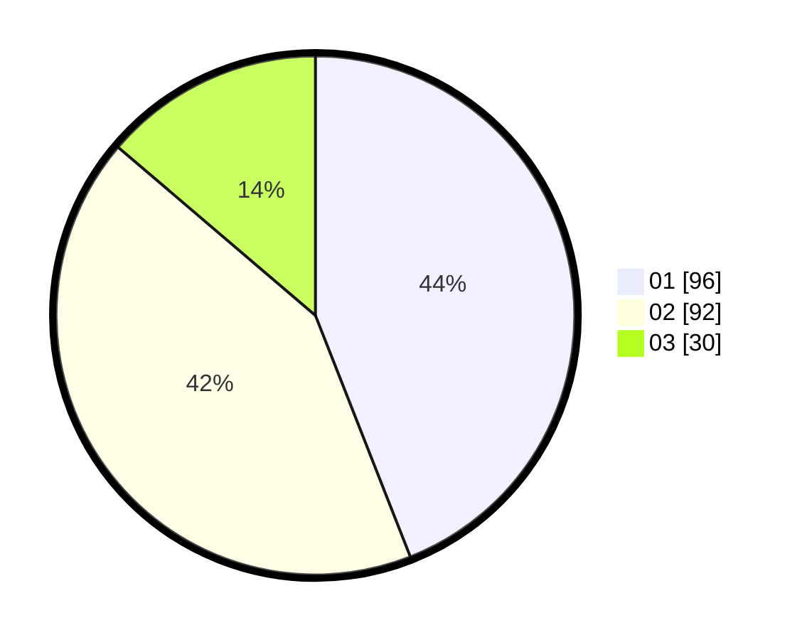

# Hasil

Hasil perolehan suara paslon dapat dilihat pada file paslon-01.txt, paslon-02.txt, dan paslon-03.txt.

Jika tidak ada, artinya data tersebut belum ada pada SIREKAP.

## Perolehan Suara

 * Paslon 01: **96**.
 * Paslon 02: **92**.
 * Paslon 03: **30**.

## Foto C Plano

https://sirekap-obj-formc.kpu.go.id/ad15/pemilu/ppwp/31/74/07/10/10/3174071010080-20240215-225739--bf4993c4-9c64-4cd8-9fb3-57d77cbcc530.jpg

https://sirekap-obj-formc.kpu.go.id/ad15/pemilu/ppwp/31/74/07/10/10/3174071010080-20240215-225741--ba0dcb3f-f043-41cb-8c97-f713ab20dbdd.jpg

https://sirekap-obj-formc.kpu.go.id/ad15/pemilu/ppwp/31/74/07/10/10/3174071010080-20240215-225740--3bd1a9c6-5433-47f3-9e71-f3881ebeb0db.jpg

## DATA PEMILIH TETAP

Jumlah pemilih dalam DPT: **292**.
 * L: **144**.
 * P: **148**.

## DATA PENGGUNA HAK PILIH

Jumlah pengguna hak pilih dalam DPT: **216**.
 * L: **107**.
 * P: **109**.

Jumlah pengguna hak pilih dalam DPTb: **1**.
 * L: **1**.
 * P: **0**.

Jumlah pengguna hak pilih dalam DPK: **3**.
 * L: **1**.
 * P: **2**.

Jumlah pengguna hak pilih: **220**.
 * L: **109**.
 * P: **111**.

## JUMLAH SUARA SAH DAN TIDAK SAH

JUMLAH SELURUH SUARA SAH: **218**.

JUMLAH SUARA TIDAK SAH: **2**.

JUMLAH SELURUH SUARA SAH DAN SUARA TIDAK SAH: **220**.
