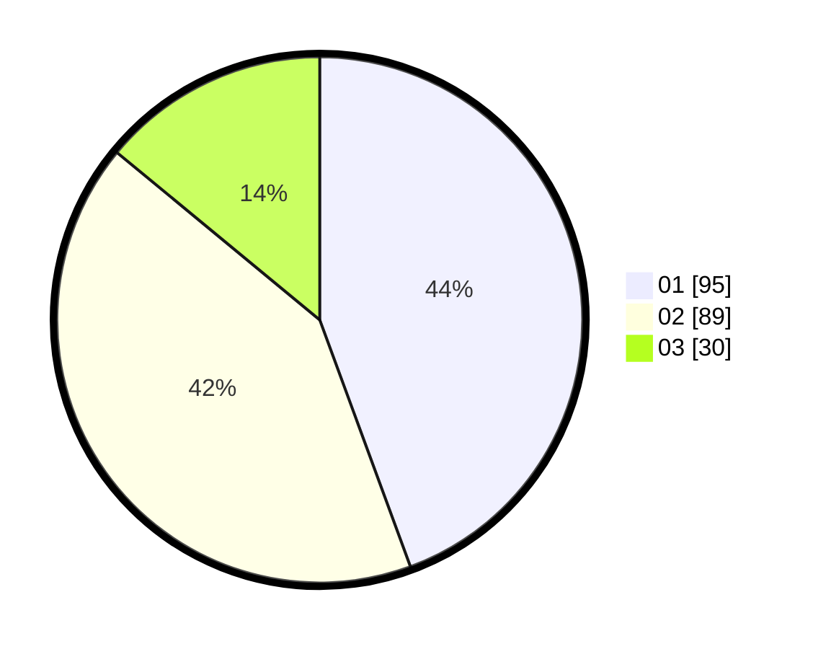

# Hasil

Hasil perolehan suara paslon dapat dilihat pada file paslon-01.txt, paslon-02.txt, dan paslon-03.txt.

Jika tidak ada, artinya data tersebut belum ada pada SIREKAP.

## Perolehan Suara

 * Paslon 01: **95**.
 * Paslon 02: **89**.
 * Paslon 03: **30**.

## Foto C Plano

https://sirekap-obj-formc.kpu.go.id/749a/pemilu/ppwp/31/74/07/10/10/3174071010081-20240214-155204--2e056e5e-e489-4097-8420-9807aa162a8b.jpg

https://sirekap-obj-formc.kpu.go.id/749a/pemilu/ppwp/31/74/07/10/10/3174071010081-20240214-155119--0081af04-7642-4d98-a489-124051787ebf.jpg

https://sirekap-obj-formc.kpu.go.id/749a/pemilu/ppwp/31/74/07/10/10/3174071010081-20240214-155244--806e5b65-90e1-48b3-a5b6-42aaa8db2884.jpg

## DATA PEMILIH TETAP

Jumlah pemilih dalam DPT: **288**.
 * L: **140**.
 * P: **148**.

## DATA PENGGUNA HAK PILIH

Jumlah pengguna hak pilih dalam DPT: **217**.
 * L: **101**.
 * P: **116**.

Jumlah pengguna hak pilih dalam DPTb: **0**.
 * L: **0**.
 * P: **0**.

Jumlah pengguna hak pilih dalam DPK: **3**.
 * L: **1**.
 * P: **2**.

Jumlah pengguna hak pilih: **220**.
 * L: **102**.
 * P: **118**.

## JUMLAH SUARA SAH DAN TIDAK SAH

JUMLAH SELURUH SUARA SAH: **214**.

JUMLAH SUARA TIDAK SAH: **6**.

JUMLAH SELURUH SUARA SAH DAN SUARA TIDAK SAH: **220**.
