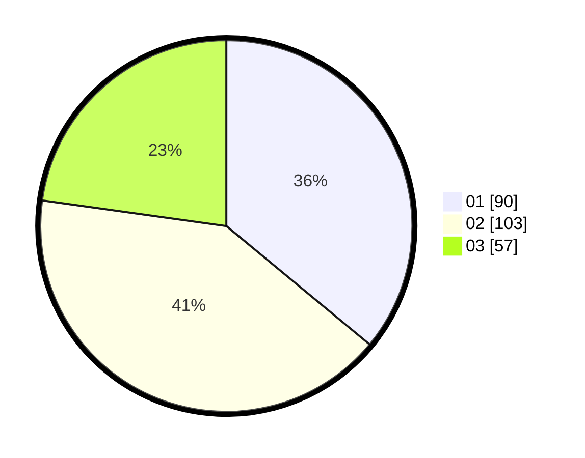

# Hasil

Hasil perolehan suara paslon dapat dilihat pada file paslon-01.txt, paslon-02.txt, dan paslon-03.txt.

Jika tidak ada, artinya data tersebut belum ada pada SIREKAP.

## Perolehan Suara

 * Paslon 01: **90**.
 * Paslon 02: **103**.
 * Paslon 03: **57**.

## Foto C Plano

https://sirekap-obj-formc.kpu.go.id/7500/pemilu/ppwp/31/74/07/10/10/3174071010083-20240214-155142--5c574410-1bc9-481c-af1d-7b86b9efa5ca.jpg

https://sirekap-obj-formc.kpu.go.id/7500/pemilu/ppwp/31/74/07/10/10/3174071010083-20240214-155255--9f008056-c406-439f-9153-ea8210e453e7.jpg

https://sirekap-obj-formc.kpu.go.id/7500/pemilu/ppwp/31/74/07/10/10/3174071010083-20240214-155310--1b0387b9-f40c-415c-9d7e-c72b16a67f89.jpg

## DATA PEMILIH TETAP

Jumlah pemilih dalam DPT: **299**.
 * L: **151**.
 * P: **148**.

## DATA PENGGUNA HAK PILIH

Jumlah pengguna hak pilih dalam DPT: **248**.
 * L: **124**.
 * P: **124**.

Jumlah pengguna hak pilih dalam DPTb: **7**.
 * L: **3**.
 * P: **4**.

Jumlah pengguna hak pilih dalam DPK: **2**.
 * L: **0**.
 * P: **2**.

Jumlah pengguna hak pilih: **257**.
 * L: **127**.
 * P: **130**.

## JUMLAH SUARA SAH DAN TIDAK SAH

JUMLAH SELURUH SUARA SAH: **250**.

JUMLAH SUARA TIDAK SAH: **7**.

JUMLAH SELURUH SUARA SAH DAN SUARA TIDAK SAH: **257**.
