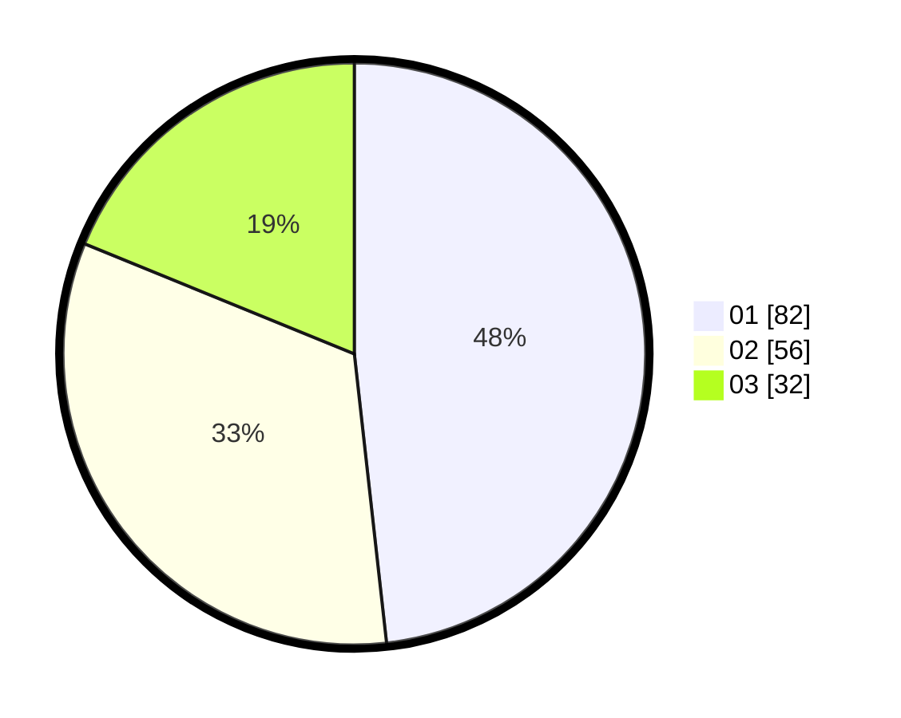

# Hasil

Hasil perolehan suara paslon dapat dilihat pada file paslon-01.txt, paslon-02.txt, dan paslon-03.txt.

Jika tidak ada, artinya data tersebut belum ada pada SIREKAP.

## Perolehan Suara

 * Paslon 01: **82**.
 * Paslon 02: **56**.
 * Paslon 03: **32**.

## Foto C Plano

https://sirekap-obj-formc.kpu.go.id/f5f3/pemilu/ppwp/31/74/07/10/10/3174071010090-20240216-001609--e13f2187-c2ff-483c-bb28-fc4129567562.jpg

https://sirekap-obj-formc.kpu.go.id/f5f3/pemilu/ppwp/31/74/07/10/10/3174071010090-20240216-001612--1dbb43c0-8c6e-4a14-b3dd-7711e89fa2f6.jpg

https://sirekap-obj-formc.kpu.go.id/f5f3/pemilu/ppwp/31/74/07/10/10/3174071010090-20240216-001610--ed5b6a31-b656-436b-9800-52dfdd4d3d50.jpg

## DATA PEMILIH TETAP

Jumlah pemilih dalam DPT: **214**.
 * L: **106**.
 * P: **108**.

## DATA PENGGUNA HAK PILIH

Jumlah pengguna hak pilih dalam DPT: **154**.
 * L: **77**.
 * P: **77**.

Jumlah pengguna hak pilih dalam DPTb: **18**.
 * L: **3**.
 * P: **15**.

Jumlah pengguna hak pilih dalam DPK: **3**.
 * L: **1**.
 * P: **2**.

Jumlah pengguna hak pilih: **175**.
 * L: **81**.
 * P: **94**.

## JUMLAH SUARA SAH DAN TIDAK SAH

JUMLAH SELURUH SUARA SAH: **170**.

JUMLAH SUARA TIDAK SAH: **5**.

JUMLAH SELURUH SUARA SAH DAN SUARA TIDAK SAH: **175**.
