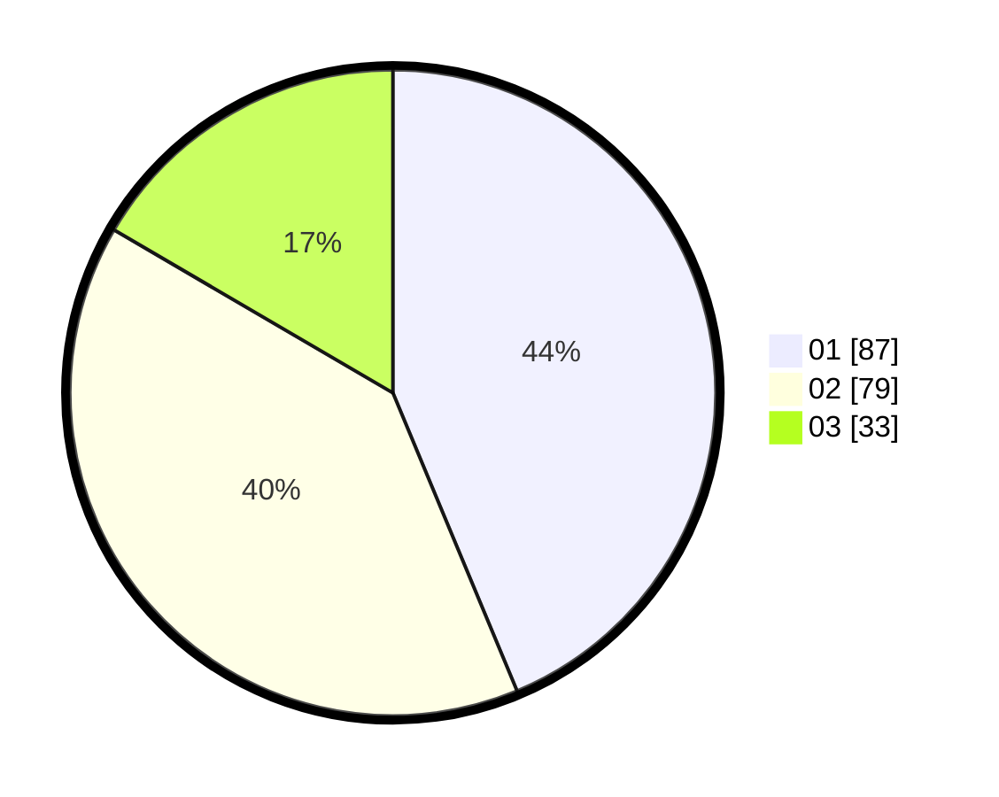

# Hasil

Hasil perolehan suara paslon dapat dilihat pada file paslon-01.txt, paslon-02.txt, dan paslon-03.txt.

Jika tidak ada, artinya data tersebut belum ada pada SIREKAP.

## Perolehan Suara

 * Paslon 01: **87**.
 * Paslon 02: **79**.
 * Paslon 03: **33**.

## Foto C Plano

https://sirekap-obj-formc.kpu.go.id/05ac/pemilu/ppwp/31/74/07/10/10/3174071010096-20240216-211421--6393c86d-3ce0-4fed-a2fa-865667e7e7d0.jpg

https://sirekap-obj-formc.kpu.go.id/05ac/pemilu/ppwp/31/74/07/10/10/3174071010096-20240216-211422--c9c0326f-0315-4166-a54f-d7164054710c.jpg

https://sirekap-obj-formc.kpu.go.id/05ac/pemilu/ppwp/31/74/07/10/10/3174071010096-20240216-211422--e149a195-9996-4728-9cec-1fa62d0498eb.jpg

## DATA PEMILIH TETAP

Jumlah pemilih dalam DPT: **259**.
 * L: **120**.
 * P: **139**.

## DATA PENGGUNA HAK PILIH

Jumlah pengguna hak pilih dalam DPT: **192**.
 * L: **89**.
 * P: **103**.

Jumlah pengguna hak pilih dalam DPTb: **8**.
 * L: **6**.
 * P: **2**.

Jumlah pengguna hak pilih dalam DPK: **4**.
 * L: **2**.
 * P: **2**.

Jumlah pengguna hak pilih: **204**.
 * L: **97**.
 * P: **107**.

## JUMLAH SUARA SAH DAN TIDAK SAH

JUMLAH SELURUH SUARA SAH: **199**.

JUMLAH SUARA TIDAK SAH: **5**.

JUMLAH SELURUH SUARA SAH DAN SUARA TIDAK SAH: **204**.
