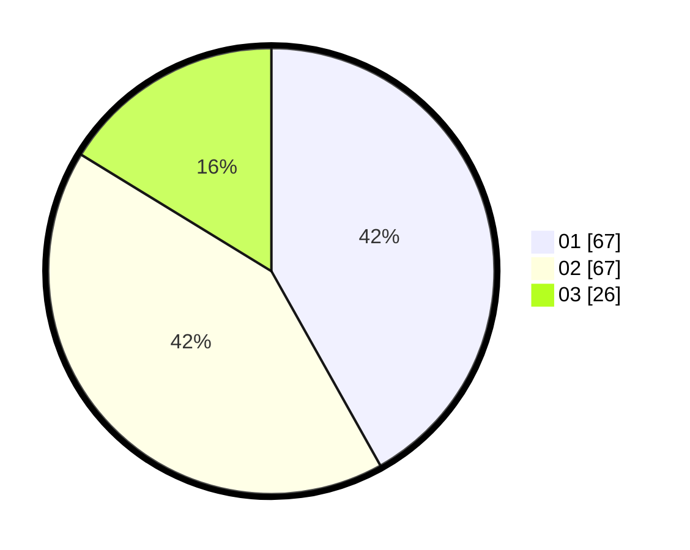

# Hasil

Hasil perolehan suara paslon dapat dilihat pada file paslon-01.txt, paslon-02.txt, dan paslon-03.txt.

Jika tidak ada, artinya data tersebut belum ada pada SIREKAP.

## Perolehan Suara

 * Paslon 01: **67**.
 * Paslon 02: **67**.
 * Paslon 03: **26**.

## Foto C Plano

https://sirekap-obj-formc.kpu.go.id/23e4/pemilu/ppwp/31/74/07/10/10/3174071010100-20240214-193803--5859bbbc-50e6-42ed-829f-58dc6f1e69d8.jpg

https://sirekap-obj-formc.kpu.go.id/23e4/pemilu/ppwp/31/74/07/10/10/3174071010100-20240214-194138--22f043c8-b20c-41d0-a127-a680da6c125f.jpg

https://sirekap-obj-formc.kpu.go.id/23e4/pemilu/ppwp/31/74/07/10/10/3174071010100-20240214-194723--9f2f3936-6be0-426f-8fa2-3c3ba78707c1.jpg

## DATA PEMILIH TETAP

Jumlah pemilih dalam DPT: **208**.
 * L: **95**.
 * P: **113**.

## DATA PENGGUNA HAK PILIH

Jumlah pengguna hak pilih dalam DPT: **157**.
 * L: **69**.
 * P: **88**.

Jumlah pengguna hak pilih dalam DPTb: **7**.
 * L: **3**.
 * P: **4**.

Jumlah pengguna hak pilih dalam DPK: **0**.
 * L: **0**.
 * P: **0**.

Jumlah pengguna hak pilih: **164**.
 * L: **72**.
 * P: **92**.

## JUMLAH SUARA SAH DAN TIDAK SAH

JUMLAH SELURUH SUARA SAH: **160**.

JUMLAH SUARA TIDAK SAH: **4**.

JUMLAH SELURUH SUARA SAH DAN SUARA TIDAK SAH: **164**.
