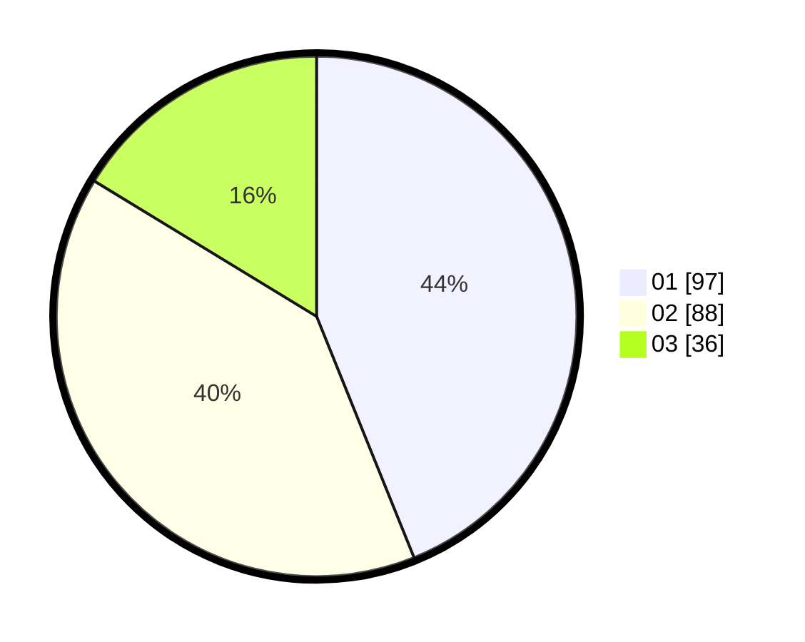

# Hasil

Hasil perolehan suara paslon dapat dilihat pada file paslon-01.txt, paslon-02.txt, dan paslon-03.txt.

Jika tidak ada, artinya data tersebut belum ada pada SIREKAP.

## Perolehan Suara

 * Paslon 01: **97**.
 * Paslon 02: **88**.
 * Paslon 03: **36**.

## Foto C Plano

https://sirekap-obj-formc.kpu.go.id/4aff/pemilu/ppwp/31/74/07/10/10/3174071010105-20240214-233621--99669063-6fae-4282-aacc-cf72a3f70c89.jpg

https://sirekap-obj-formc.kpu.go.id/4aff/pemilu/ppwp/31/74/07/10/10/3174071010105-20240214-233652--31519383-88f2-498d-acc3-dfe4b91bf39a.jpg

https://sirekap-obj-formc.kpu.go.id/4aff/pemilu/ppwp/31/74/07/10/10/3174071010105-20240214-233736--cda2bbeb-20ac-4348-b22e-d94a528ddb53.jpg
