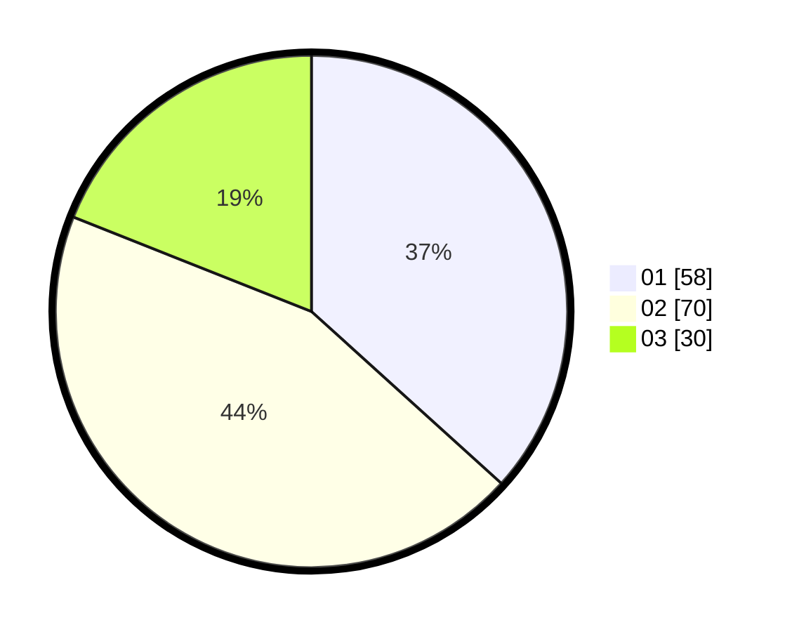

# Hasil

Hasil perolehan suara paslon dapat dilihat pada file paslon-01.txt, paslon-02.txt, dan paslon-03.txt.

Jika tidak ada, artinya data tersebut belum ada pada SIREKAP.

## Perolehan Suara

 * Paslon 01: **58**.
 * Paslon 02: **70**.
 * Paslon 03: **30**.

## Foto C Plano

https://sirekap-obj-formc.kpu.go.id/789a/pemilu/ppwp/31/74/07/10/10/3174071010110-20240216-135115--73a44925-10ae-4d4e-a166-38c2b8528073.jpg

https://sirekap-obj-formc.kpu.go.id/789a/pemilu/ppwp/31/74/07/10/10/3174071010110-20240215-000746--7009493e-7c82-4327-8027-eca75162736a.jpg

https://sirekap-obj-formc.kpu.go.id/789a/pemilu/ppwp/31/74/07/10/10/3174071010110-20240216-135116--9c2f7a34-8203-4a48-9cd3-3c5ca98e0755.jpg

## DATA PEMILIH TETAP

Jumlah pemilih dalam DPT: **209**.
 * L: **105**.
 * P: **104**.

## DATA PENGGUNA HAK PILIH

Jumlah pengguna hak pilih dalam DPT: **154**.
 * L: **77**.
 * P: **77**.

Jumlah pengguna hak pilih dalam DPTb: **6**.
 * L: **1**.
 * P: **5**.

Jumlah pengguna hak pilih dalam DPK: **3**.
 * L: **2**.
 * P: **1**.

Jumlah pengguna hak pilih: **163**.
 * L: **80**.
 * P: **83**.

## JUMLAH SUARA SAH DAN TIDAK SAH

JUMLAH SELURUH SUARA SAH: **158**.

JUMLAH SUARA TIDAK SAH: **5**.

JUMLAH SELURUH SUARA SAH DAN SUARA TIDAK SAH: **163**.
