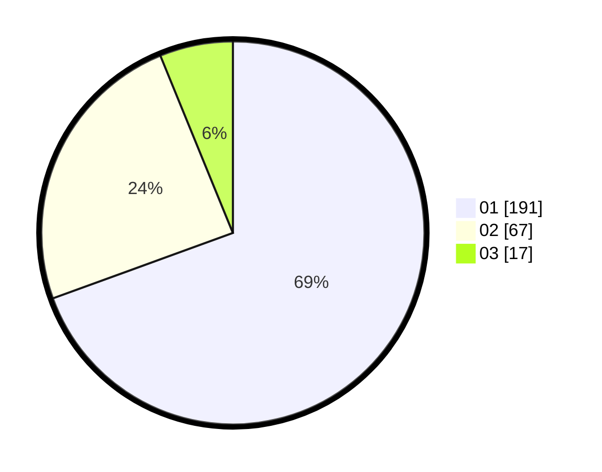

# Hasil

Hasil perolehan suara paslon dapat dilihat pada file paslon-01.txt, paslon-02.txt, dan paslon-03.txt.

Jika tidak ada, artinya data tersebut belum ada pada SIREKAP.

## Perolehan Suara

 * Paslon 01: **191**.
 * Paslon 02: **67**.
 * Paslon 03: **17**.

## Foto C Plano

https://sirekap-obj-formc.kpu.go.id/e8ab/pemilu/ppwp/31/74/08/10/01/3174081001008-20240214-204904--e0143a4e-39a7-4eb0-b8d4-34105daf9b6f.jpg

https://sirekap-obj-formc.kpu.go.id/e8ab/pemilu/ppwp/31/74/08/10/01/3174081001008-20240218-103752--896cd2d7-87cb-423a-9c91-38edecb4a20d.jpg

https://sirekap-obj-formc.kpu.go.id/e8ab/pemilu/ppwp/31/74/08/10/01/3174081001008-20240218-104235--ab5640c4-53be-40aa-8b75-7789c773b3a3.jpg

## DATA PEMILIH TETAP

Jumlah pemilih dalam DPT: **292**.
 * L: **146**.
 * P: **146**.

## DATA PENGGUNA HAK PILIH

Jumlah pengguna hak pilih dalam DPT: **260**.
 * L: **132**.
 * P: **128**.

Jumlah pengguna hak pilih dalam DPTb: **16**.
 * L: **9**.
 * P: **7**.

Jumlah pengguna hak pilih dalam DPK: **1**.
 * L: **1**.
 * P: **0**.

Jumlah pengguna hak pilih: **277**.
 * L: **142**.
 * P: **135**.

## JUMLAH SUARA SAH DAN TIDAK SAH

JUMLAH SELURUH SUARA SAH: **275**.

JUMLAH SUARA TIDAK SAH: **2**.

JUMLAH SELURUH SUARA SAH DAN SUARA TIDAK SAH: **277**.
