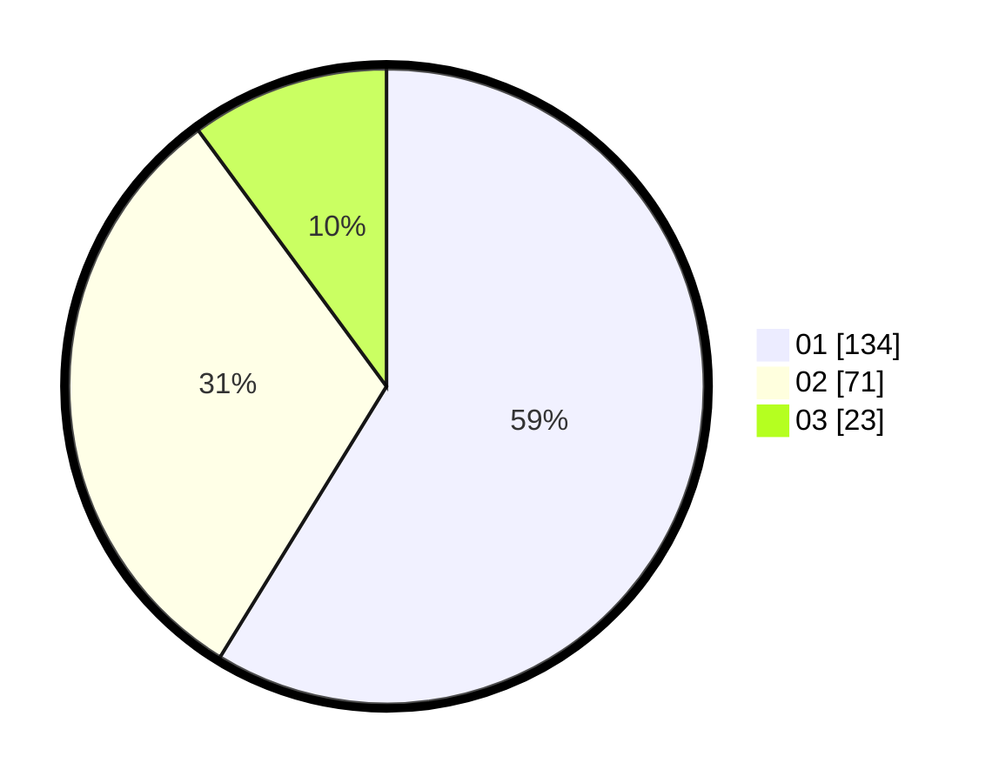

# Hasil

Hasil perolehan suara paslon dapat dilihat pada file paslon-01.txt, paslon-02.txt, dan paslon-03.txt.

Jika tidak ada, artinya data tersebut belum ada pada SIREKAP.

## Perolehan Suara

 * Paslon 01: **134**.
 * Paslon 02: **71**.
 * Paslon 03: **23**.

## Foto C Plano

https://sirekap-obj-formc.kpu.go.id/b655/pemilu/ppwp/31/74/08/10/01/3174081001009-20240218-132205--f8384286-0785-43e5-9eff-4ceec2d5db24.jpg

https://sirekap-obj-formc.kpu.go.id/b655/pemilu/ppwp/31/74/08/10/01/3174081001009-20240218-133117--54026297-8d9f-4396-af41-e252643250a7.jpg

https://sirekap-obj-formc.kpu.go.id/b655/pemilu/ppwp/31/74/08/10/01/3174081001009-20240218-134352--6fc363bf-e1a8-4155-a2cd-68c9bc9c9541.jpg

## DATA PEMILIH TETAP

Jumlah pemilih dalam DPT: **263**.
 * L: **139**.
 * P: **124**.

## DATA PENGGUNA HAK PILIH

Jumlah pengguna hak pilih dalam DPT: **215**.
 * L: **108**.
 * P: **107**.

Jumlah pengguna hak pilih dalam DPTb: **14**.
 * L: **9**.
 * P: **5**.

Jumlah pengguna hak pilih dalam DPK: **1**.
 * L: **0**.
 * P: **1**.

Jumlah pengguna hak pilih: **230**.
 * L: **117**.
 * P: **113**.

## JUMLAH SUARA SAH DAN TIDAK SAH

JUMLAH SELURUH SUARA SAH: **228**.

JUMLAH SUARA TIDAK SAH: **2**.

JUMLAH SELURUH SUARA SAH DAN SUARA TIDAK SAH: **230**.
