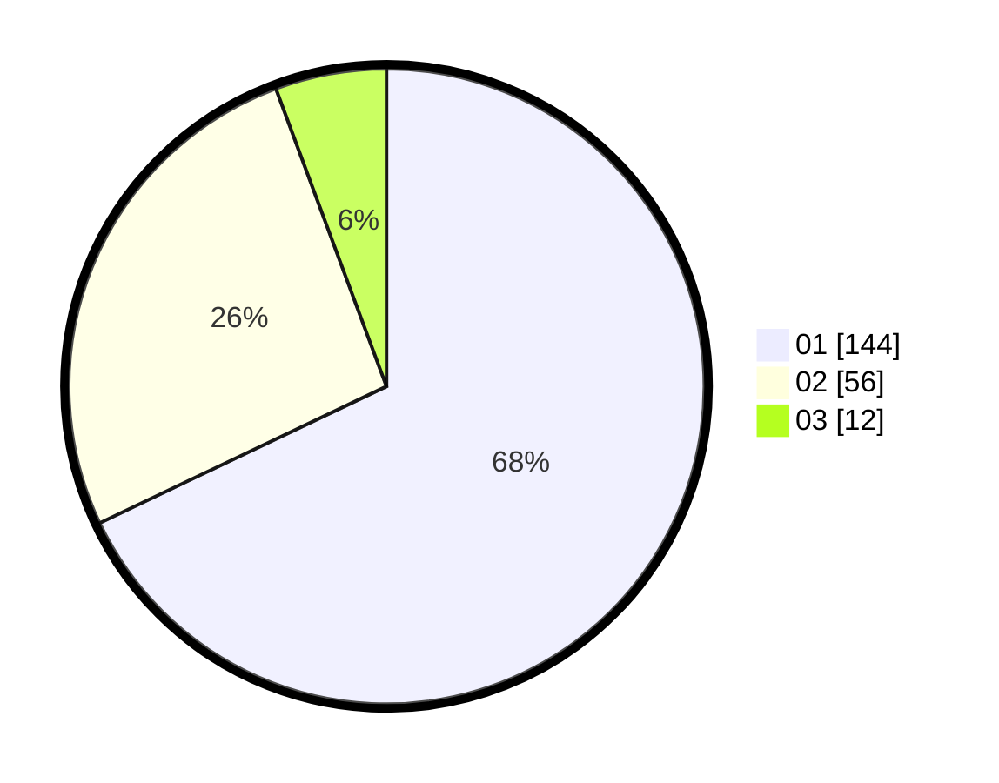

# Hasil

Hasil perolehan suara paslon dapat dilihat pada file paslon-01.txt, paslon-02.txt, dan paslon-03.txt.

Jika tidak ada, artinya data tersebut belum ada pada SIREKAP.

## Perolehan Suara

 * Paslon 01: **144**.
 * Paslon 02: **56**.
 * Paslon 03: **12**.

## Foto C Plano

https://sirekap-obj-formc.kpu.go.id/b158/pemilu/ppwp/31/74/08/10/01/3174081001010-20240215-005221--3df9075a-a0ba-49ba-88a9-3869b324a7fa.jpg

https://sirekap-obj-formc.kpu.go.id/b158/pemilu/ppwp/31/74/08/10/01/3174081001010-20240214-184612--ecf3cc52-3d04-4a68-a7b2-987874d3b8a9.jpg

https://sirekap-obj-formc.kpu.go.id/b158/pemilu/ppwp/31/74/08/10/01/3174081001010-20240217-190714--a565beae-ebaf-4ba2-a154-7875bea436f5.jpg

## DATA PEMILIH TETAP

Jumlah pemilih dalam DPT: **284**.
 * L: **145**.
 * P: **139**.

## DATA PENGGUNA HAK PILIH

Jumlah pengguna hak pilih dalam DPT: **210**.
 * L: **104**.
 * P: **106**.

Jumlah pengguna hak pilih dalam DPTb: **6**.
 * L: **2**.
 * P: **4**.

Jumlah pengguna hak pilih dalam DPK: **0**.
 * L: **0**.
 * P: **0**.

Jumlah pengguna hak pilih: **216**.
 * L: **106**.
 * P: **110**.

## JUMLAH SUARA SAH DAN TIDAK SAH

JUMLAH SELURUH SUARA SAH: **212**.

JUMLAH SUARA TIDAK SAH: **4**.

JUMLAH SELURUH SUARA SAH DAN SUARA TIDAK SAH: **216**.
