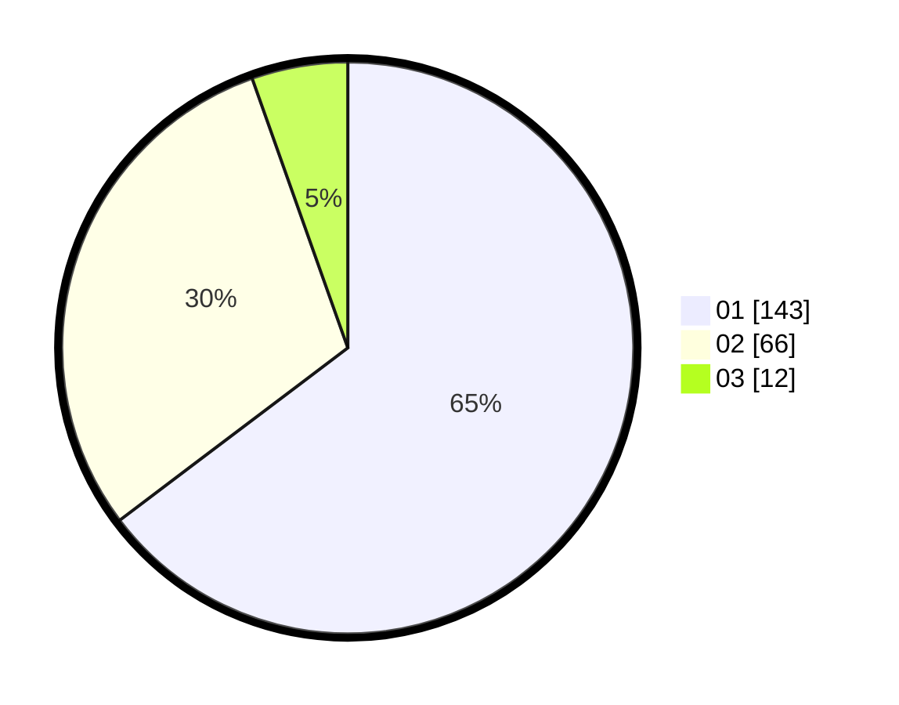

# Hasil

Hasil perolehan suara paslon dapat dilihat pada file paslon-01.txt, paslon-02.txt, dan paslon-03.txt.

Jika tidak ada, artinya data tersebut belum ada pada SIREKAP.

## Perolehan Suara

 * Paslon 01: **143**.
 * Paslon 02: **66**.
 * Paslon 03: **12**.

## Foto C Plano

https://sirekap-obj-formc.kpu.go.id/f801/pemilu/ppwp/31/74/08/10/01/3174081001012-20240217-162832--3247d789-0dbd-4d31-97b4-1eb198aee1e4.jpg

https://sirekap-obj-formc.kpu.go.id/f801/pemilu/ppwp/31/74/08/10/01/3174081001012-20240217-163814--b7e7fa2a-a3e9-417e-9b57-667eb66b8f15.jpg

https://sirekap-obj-formc.kpu.go.id/f801/pemilu/ppwp/31/74/08/10/01/3174081001012-20240217-173926--f81b30a5-e1bc-43eb-92b7-e928d6c3bfdc.jpg

## DATA PEMILIH TETAP

Jumlah pemilih dalam DPT: **257**.
 * L: **119**.
 * P: **138**.

## DATA PENGGUNA HAK PILIH

Jumlah pengguna hak pilih dalam DPT: **219**.
 * L: **101**.
 * P: **118**.

Jumlah pengguna hak pilih dalam DPTb: **4**.
 * L: **1**.
 * P: **3**.

Jumlah pengguna hak pilih dalam DPK: **1**.
 * L: **1**.
 * P: **0**.

Jumlah pengguna hak pilih: **224**.
 * L: **103**.
 * P: **121**.

## JUMLAH SUARA SAH DAN TIDAK SAH

JUMLAH SELURUH SUARA SAH: **221**.

JUMLAH SUARA TIDAK SAH: **3**.

JUMLAH SELURUH SUARA SAH DAN SUARA TIDAK SAH: **224**.
