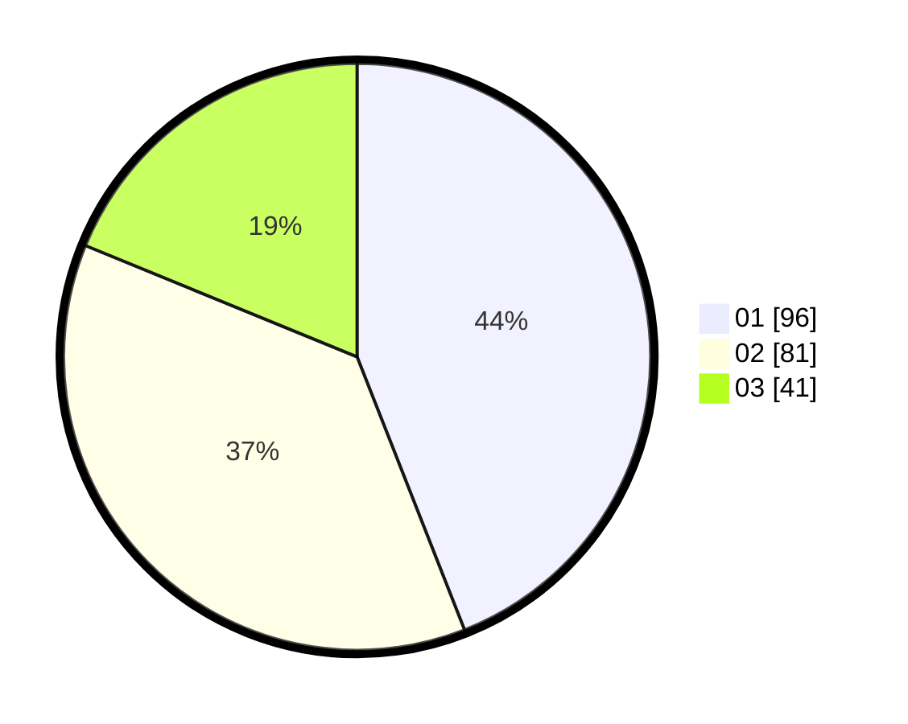

# Hasil

Hasil perolehan suara paslon dapat dilihat pada file paslon-01.txt, paslon-02.txt, dan paslon-03.txt.

Jika tidak ada, artinya data tersebut belum ada pada SIREKAP.

## Perolehan Suara

 * Paslon 01: **96**.
 * Paslon 02: **81**.
 * Paslon 03: **41**.

## Foto C Plano

https://sirekap-obj-formc.kpu.go.id/4568/pemilu/ppwp/31/74/08/10/01/3174081001016-20240217-220758--04bc07ce-9003-421b-bd3f-4f5cd8c58bdd.jpg

https://sirekap-obj-formc.kpu.go.id/4568/pemilu/ppwp/31/74/08/10/01/3174081001016-20240217-220759--cf5d425f-4b82-4a0e-8544-e66951973271.jpg

https://sirekap-obj-formc.kpu.go.id/4568/pemilu/ppwp/31/74/08/10/01/3174081001016-20240217-220759--6ad12d98-b467-44e0-b245-6a48fc32332f.jpg

## DATA PEMILIH TETAP

Jumlah pemilih dalam DPT: **269**.
 * L: **0**.
 * P: **150**.

## DATA PENGGUNA HAK PILIH

Jumlah pengguna hak pilih dalam DPT: **191**.
 * L: **83**.
 * P: **108**.

Jumlah pengguna hak pilih dalam DPTb: **24**.
 * L: **8**.
 * P: **16**.

Jumlah pengguna hak pilih dalam DPK: **5**.
 * L: **2**.
 * P: **3**.

Jumlah pengguna hak pilih: **220**.
 * L: **93**.
 * P: **127**.

## JUMLAH SUARA SAH DAN TIDAK SAH

JUMLAH SELURUH SUARA SAH: **218**.

JUMLAH SUARA TIDAK SAH: **3**.

JUMLAH SELURUH SUARA SAH DAN SUARA TIDAK SAH: **221**.
