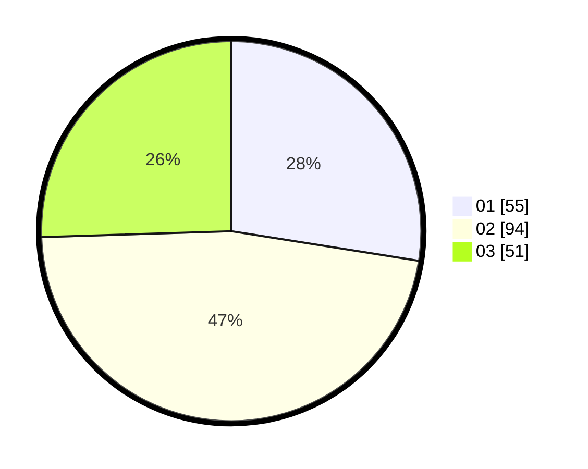

# Hasil

Hasil perolehan suara paslon dapat dilihat pada file paslon-01.txt, paslon-02.txt, dan paslon-03.txt.

Jika tidak ada, artinya data tersebut belum ada pada SIREKAP.

## Perolehan Suara

 * Paslon 01: **55**.
 * Paslon 02: **94**.
 * Paslon 03: **51**.

## Foto C Plano

https://sirekap-obj-formc.kpu.go.id/4a8e/pemilu/ppwp/31/74/08/10/01/3174081001017-20240217-171102--3d8ef06d-7c2c-4069-bb72-a0a3546a22a3.jpg

https://sirekap-obj-formc.kpu.go.id/4a8e/pemilu/ppwp/31/74/08/10/01/3174081001017-20240217-171206--74318d09-f316-431d-80b0-0e0cf583bea9.jpg

https://sirekap-obj-formc.kpu.go.id/4a8e/pemilu/ppwp/31/74/08/10/01/3174081001017-20240217-171210--b4208b64-3ed0-4702-8a36-1062847edd73.jpg

## DATA PEMILIH TETAP

Jumlah pemilih dalam DPT: **237**.
 * L: **119**.
 * P: **218**.

## DATA PENGGUNA HAK PILIH

Jumlah pengguna hak pilih dalam DPT: **174**.
 * L: **80**.
 * P: **94**.

Jumlah pengguna hak pilih dalam DPTb: **24**.
 * L: **12**.
 * P: **22**.

Jumlah pengguna hak pilih dalam DPK: **4**.
 * L: **2**.
 * P: **2**.

Jumlah pengguna hak pilih: **2**.
 * L: **94**.
 * P: **708**.

## JUMLAH SUARA SAH DAN TIDAK SAH

JUMLAH SELURUH SUARA SAH: **200**.

JUMLAH SUARA TIDAK SAH: **2**.

JUMLAH SELURUH SUARA SAH DAN SUARA TIDAK SAH: **202**.
