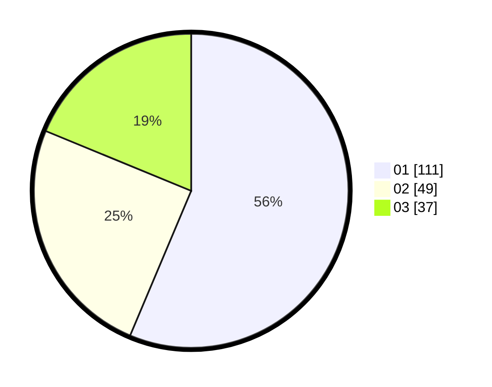

# Hasil

Hasil perolehan suara paslon dapat dilihat pada file paslon-01.txt, paslon-02.txt, dan paslon-03.txt.

Jika tidak ada, artinya data tersebut belum ada pada SIREKAP.

## Perolehan Suara

 * Paslon 01: **111**.
 * Paslon 02: **49**.
 * Paslon 03: **37**.

## Foto C Plano

https://sirekap-obj-formc.kpu.go.id/a06e/pemilu/ppwp/31/74/08/10/01/3174081001020-20240218-135357--5d216048-0d73-49ce-80b3-9283c274f399.jpg

https://sirekap-obj-formc.kpu.go.id/a06e/pemilu/ppwp/31/74/08/10/01/3174081001020-20240218-135359--58e0be24-cb1f-4981-9953-d1cd4dea462c.jpg

https://sirekap-obj-formc.kpu.go.id/a06e/pemilu/ppwp/31/74/08/10/01/3174081001020-20240218-135358--b30dd76f-16b8-49bc-8571-1592b2b1cae1.jpg

## DATA PEMILIH TETAP

Jumlah pemilih dalam DPT: **235**.
 * L: **111**.
 * P: **124**.

## DATA PENGGUNA HAK PILIH

Jumlah pengguna hak pilih dalam DPT: **176**.
 * L: **84**.
 * P: **92**.

Jumlah pengguna hak pilih dalam DPTb: **15**.
 * L: **7**.
 * P: **8**.

Jumlah pengguna hak pilih dalam DPK: **8**.
 * L: **3**.
 * P: **5**.

Jumlah pengguna hak pilih: **199**.
 * L: **94**.
 * P: **105**.

## JUMLAH SUARA SAH DAN TIDAK SAH

JUMLAH SELURUH SUARA SAH: **197**.

JUMLAH SUARA TIDAK SAH: **2**.

JUMLAH SELURUH SUARA SAH DAN SUARA TIDAK SAH: **199**.
