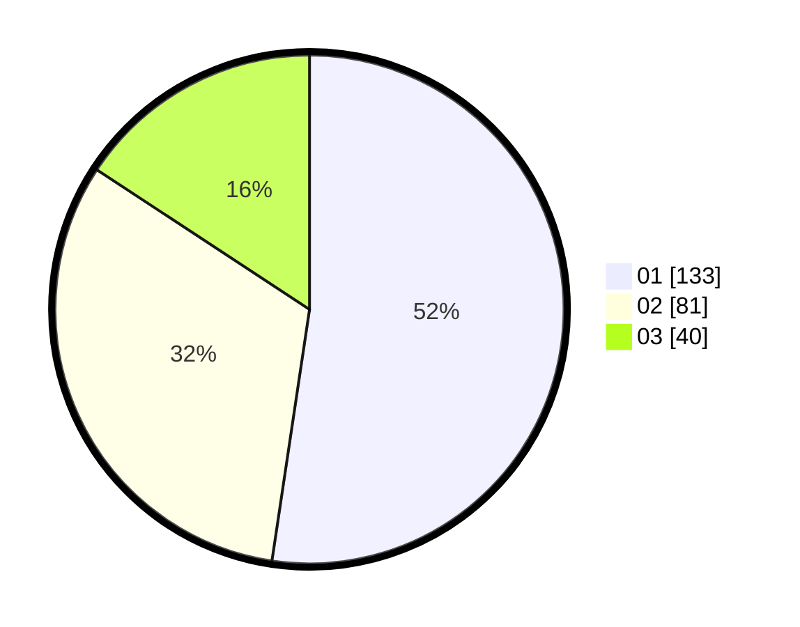

# Hasil

Hasil perolehan suara paslon dapat dilihat pada file paslon-01.txt, paslon-02.txt, dan paslon-03.txt.

Jika tidak ada, artinya data tersebut belum ada pada SIREKAP.

## Perolehan Suara

 * Paslon 01: **133**.
 * Paslon 02: **81**.
 * Paslon 03: **40**.

## Foto C Plano

https://sirekap-obj-formc.kpu.go.id/024a/pemilu/ppwp/31/74/08/10/01/3174081001023-20240218-111305--cb8bf523-481c-4dba-946f-b57da66d61f6.jpg

https://sirekap-obj-formc.kpu.go.id/024a/pemilu/ppwp/31/74/08/10/01/3174081001023-20240218-111548--6cb17cd4-032d-4ef0-b135-f5cba4adcdfd.jpg

https://sirekap-obj-formc.kpu.go.id/024a/pemilu/ppwp/31/74/08/10/01/3174081001023-20240218-111856--70d1e7c8-5d78-432a-9cc1-0bd0147289aa.jpg

## DATA PEMILIH TETAP

Jumlah pemilih dalam DPT: **280**.
 * L: **141**.
 * P: **139**.

## DATA PENGGUNA HAK PILIH

Jumlah pengguna hak pilih dalam DPT: **243**.
 * L: **116**.
 * P: **127**.

Jumlah pengguna hak pilih dalam DPTb: **11**.
 * L: **4**.
 * P: **7**.

Jumlah pengguna hak pilih dalam DPK: **1**.
 * L: **1**.
 * P: **0**.

Jumlah pengguna hak pilih: **255**.
 * L: **121**.
 * P: **134**.

## JUMLAH SUARA SAH DAN TIDAK SAH

JUMLAH SELURUH SUARA SAH: **255**.

JUMLAH SUARA TIDAK SAH: **2**.

JUMLAH SELURUH SUARA SAH DAN SUARA TIDAK SAH: **257**.
