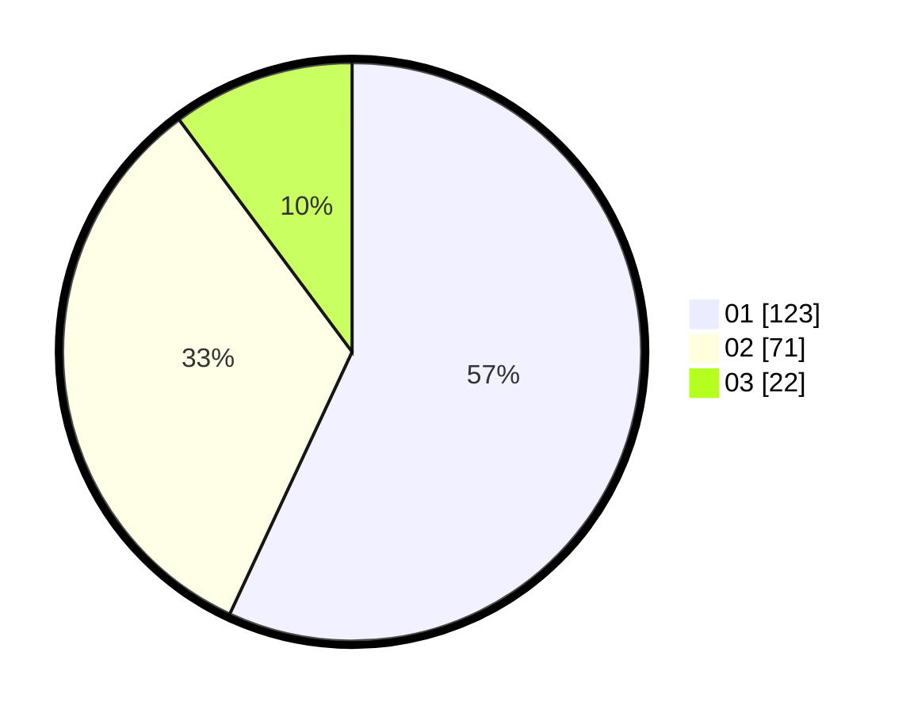

# Hasil

Hasil perolehan suara paslon dapat dilihat pada file paslon-01.txt, paslon-02.txt, dan paslon-03.txt.

Jika tidak ada, artinya data tersebut belum ada pada SIREKAP.

## Perolehan Suara

 * Paslon 01: **123**.
 * Paslon 02: **71**.
 * Paslon 03: **22**.

## Foto C Plano

https://sirekap-obj-formc.kpu.go.id/819a/pemilu/ppwp/31/74/08/10/01/3174081001024-20240214-191657--820dc2d8-0911-4363-a73c-b55f098a7dee.jpg

https://sirekap-obj-formc.kpu.go.id/819a/pemilu/ppwp/31/74/08/10/01/3174081001024-20240217-192057--4fcd2ae9-1932-406a-b595-fa5ad97f06e7.jpg

https://sirekap-obj-formc.kpu.go.id/819a/pemilu/ppwp/31/74/08/10/01/3174081001024-20240217-193103--83771a3a-480d-4043-b756-ffbf23dbe141.jpg

## DATA PEMILIH TETAP

Jumlah pemilih dalam DPT: **253**.
 * L: **114**.
 * P: **139**.

## DATA PENGGUNA HAK PILIH

Jumlah pengguna hak pilih dalam DPT: **205**.
 * L: **87**.
 * P: **118**.

Jumlah pengguna hak pilih dalam DPTb: **10**.
 * L: **5**.
 * P: **5**.

Jumlah pengguna hak pilih dalam DPK: **3**.
 * L: **3**.
 * P: **0**.

Jumlah pengguna hak pilih: **218**.
 * L: **95**.
 * P: **123**.

## JUMLAH SUARA SAH DAN TIDAK SAH

JUMLAH SELURUH SUARA SAH: **216**.

JUMLAH SUARA TIDAK SAH: **2**.

JUMLAH SELURUH SUARA SAH DAN SUARA TIDAK SAH: **218**.
