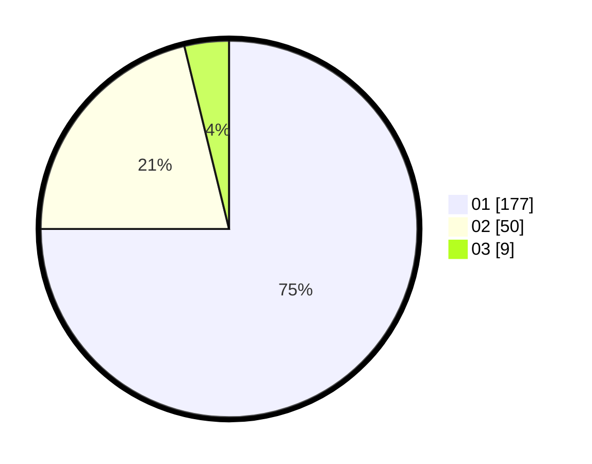

# Hasil

Hasil perolehan suara paslon dapat dilihat pada file paslon-01.txt, paslon-02.txt, dan paslon-03.txt.

Jika tidak ada, artinya data tersebut belum ada pada SIREKAP.

## Perolehan Suara

 * Paslon 01: **177**.
 * Paslon 02: **50**.
 * Paslon 03: **9**.

## Foto C Plano

https://sirekap-obj-formc.kpu.go.id/7c8e/pemilu/ppwp/31/74/08/10/01/3174081001026-20240214-192835--0dc3b699-89fc-4334-9fe5-0820bf6ae7bb.jpg

https://sirekap-obj-formc.kpu.go.id/7c8e/pemilu/ppwp/31/74/08/10/01/3174081001026-20240214-192907--1a24f453-88f9-4bea-b579-74b52d2407ef.jpg

https://sirekap-obj-formc.kpu.go.id/7c8e/pemilu/ppwp/31/74/08/10/01/3174081001026-20240214-192923--fa879224-2636-4d9c-9890-282ba25c9a16.jpg

## DATA PEMILIH TETAP

Jumlah pemilih dalam DPT: **266**.
 * L: **131**.
 * P: **135**.

## DATA PENGGUNA HAK PILIH

Jumlah pengguna hak pilih dalam DPT: **223**.
 * L: **104**.
 * P: **119**.

Jumlah pengguna hak pilih dalam DPTb: **15**.
 * L: **7**.
 * P: **8**.

Jumlah pengguna hak pilih dalam DPK: **4**.
 * L: **2**.
 * P: **2**.

Jumlah pengguna hak pilih: **242**.
 * L: **113**.
 * P: **129**.

## JUMLAH SUARA SAH DAN TIDAK SAH

JUMLAH SELURUH SUARA SAH: **236**.

JUMLAH SUARA TIDAK SAH: **6**.

JUMLAH SELURUH SUARA SAH DAN SUARA TIDAK SAH: **242**.
