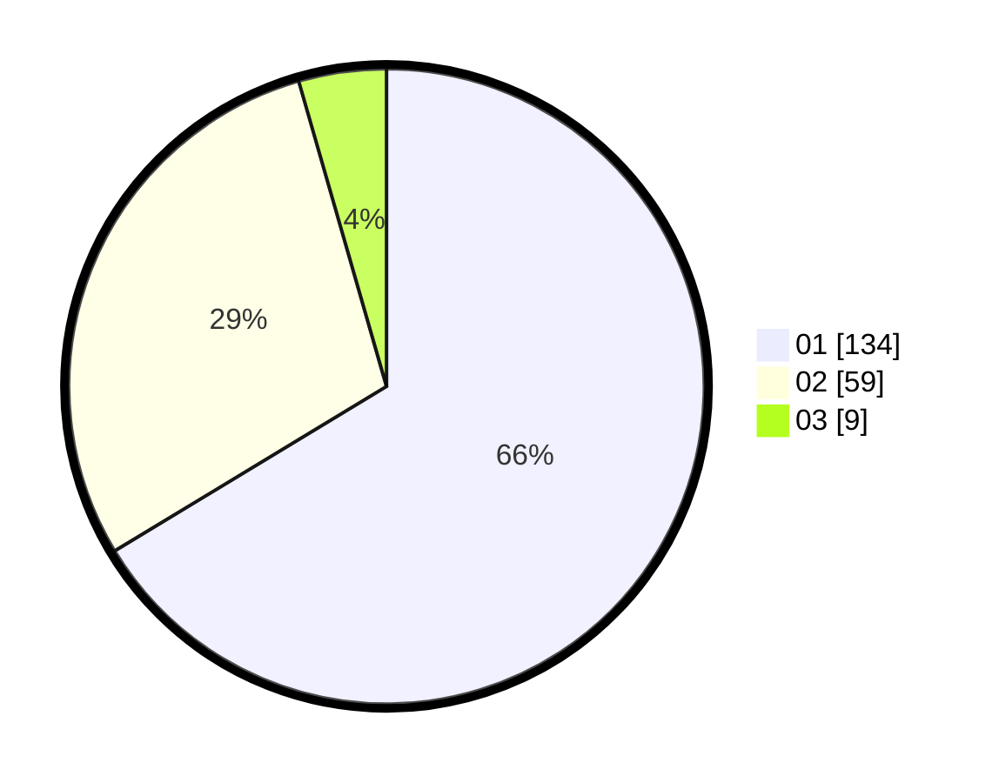

# Hasil

Hasil perolehan suara paslon dapat dilihat pada file paslon-01.txt, paslon-02.txt, dan paslon-03.txt.

Jika tidak ada, artinya data tersebut belum ada pada SIREKAP.

## Perolehan Suara

 * Paslon 01: **134**.
 * Paslon 02: **59**.
 * Paslon 03: **9**.

## Foto C Plano

https://sirekap-obj-formc.kpu.go.id/1cd1/pemilu/ppwp/31/74/08/10/01/3174081001027-20240218-001710--43e77045-6ab8-41b6-8411-d8bd048ac503.jpg

https://sirekap-obj-formc.kpu.go.id/1cd1/pemilu/ppwp/31/74/08/10/01/3174081001027-20240218-003307--e33d5caa-a3fb-42a1-ac10-c6ed903cfd38.jpg

https://sirekap-obj-formc.kpu.go.id/1cd1/pemilu/ppwp/31/74/08/10/01/3174081001027-20240217-202818--6b30a95d-bd8b-4eae-bb63-fd6a26d1c59c.jpg

## DATA PEMILIH TETAP

Jumlah pemilih dalam DPT: **219**.
 * L: **112**.
 * P: **107**.

## DATA PENGGUNA HAK PILIH

Jumlah pengguna hak pilih dalam DPT: **182**.
 * L: **95**.
 * P: **87**.

Jumlah pengguna hak pilih dalam DPTb: **20**.
 * L: **3**.
 * P: **17**.

Jumlah pengguna hak pilih dalam DPK: **1**.
 * L: **1**.
 * P: **0**.

Jumlah pengguna hak pilih: **203**.
 * L: **99**.
 * P: **104**.

## JUMLAH SUARA SAH DAN TIDAK SAH

JUMLAH SELURUH SUARA SAH: **202**.

JUMLAH SUARA TIDAK SAH: **1**.

JUMLAH SELURUH SUARA SAH DAN SUARA TIDAK SAH: **203**.
