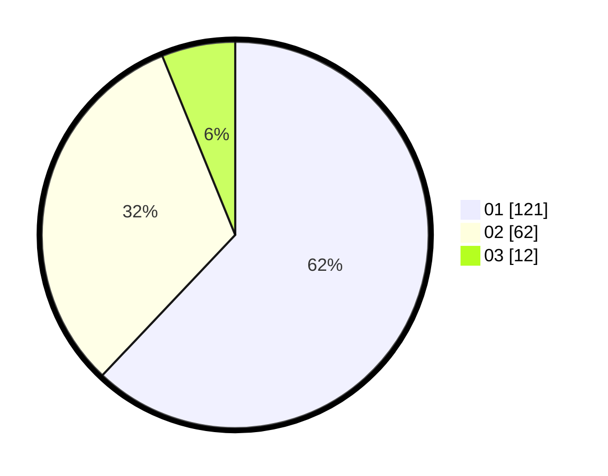

# Hasil

Hasil perolehan suara paslon dapat dilihat pada file paslon-01.txt, paslon-02.txt, dan paslon-03.txt.

Jika tidak ada, artinya data tersebut belum ada pada SIREKAP.

## Perolehan Suara

 * Paslon 01: **121**.
 * Paslon 02: **62**.
 * Paslon 03: **12**.

## Foto C Plano

https://sirekap-obj-formc.kpu.go.id/ce22/pemilu/ppwp/31/74/08/10/01/3174081001032-20240214-155253--d6d54341-18aa-47cd-bf9d-cb44172555f3.jpg

https://sirekap-obj-formc.kpu.go.id/ce22/pemilu/ppwp/31/74/08/10/01/3174081001032-20240214-155355--f2dc45ca-8bf1-4e95-ab83-04b0caa674ad.jpg

https://sirekap-obj-formc.kpu.go.id/ce22/pemilu/ppwp/31/74/08/10/01/3174081001032-20240214-155653--62284714-e3df-42d5-860e-f0e11056dcfd.jpg

## DATA PEMILIH TETAP

Jumlah pemilih dalam DPT: **246**.
 * L: **122**.
 * P: **124**.

## DATA PENGGUNA HAK PILIH

Jumlah pengguna hak pilih dalam DPT: **196**.
 * L: **95**.
 * P: **101**.

Jumlah pengguna hak pilih dalam DPTb: **2**.
 * L: **0**.
 * P: **2**.

Jumlah pengguna hak pilih dalam DPK: **4**.
 * L: **2**.
 * P: **2**.

Jumlah pengguna hak pilih: **202**.
 * L: **97**.
 * P: **105**.

## JUMLAH SUARA SAH DAN TIDAK SAH

JUMLAH SELURUH SUARA SAH: **195**.

JUMLAH SUARA TIDAK SAH: **7**.

JUMLAH SELURUH SUARA SAH DAN SUARA TIDAK SAH: **202**.
