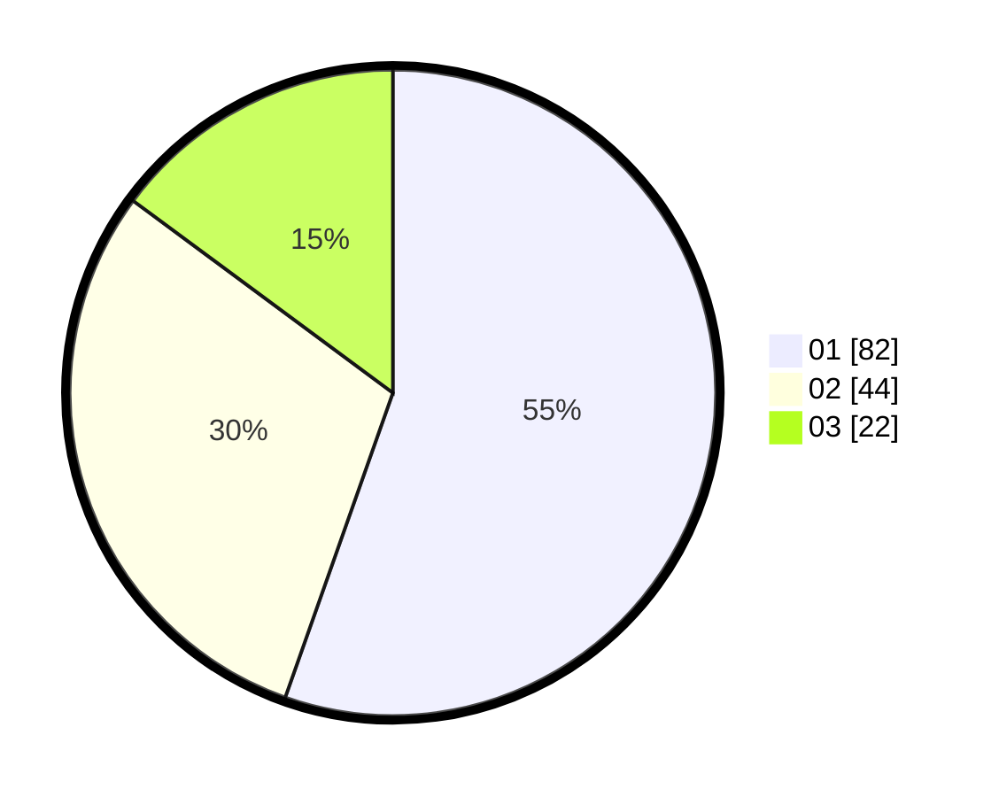

# Hasil

Hasil perolehan suara paslon dapat dilihat pada file paslon-01.txt, paslon-02.txt, dan paslon-03.txt.

Jika tidak ada, artinya data tersebut belum ada pada SIREKAP.

## Perolehan Suara

 * Paslon 01: **82**.
 * Paslon 02: **44**.
 * Paslon 03: **22**.

## Foto C Plano

https://sirekap-obj-formc.kpu.go.id/90b9/pemilu/ppwp/31/74/08/10/01/3174081001035-20240219-192239--e57e8118-390e-4476-88a7-fc1d5f5e9ad7.jpg

https://sirekap-obj-formc.kpu.go.id/90b9/pemilu/ppwp/31/74/08/10/01/3174081001035-20240219-192040--d9e73ce3-67c4-43cd-ae46-edf4390c0e86.jpg
