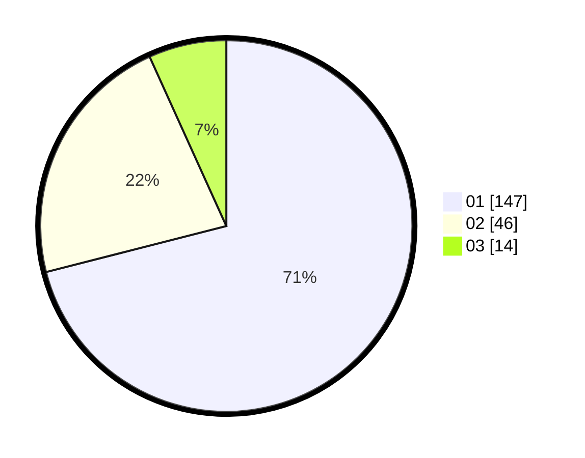

# Hasil

Hasil perolehan suara paslon dapat dilihat pada file paslon-01.txt, paslon-02.txt, dan paslon-03.txt.

Jika tidak ada, artinya data tersebut belum ada pada SIREKAP.

## Perolehan Suara

 * Paslon 01: **147**.
 * Paslon 02: **46**.
 * Paslon 03: **14**.

## Foto C Plano

https://sirekap-obj-formc.kpu.go.id/9e20/pemilu/ppwp/31/74/08/10/01/3174081001036-20240217-212610--c1c23920-305b-485d-92a3-41de105a256e.jpg

https://sirekap-obj-formc.kpu.go.id/9e20/pemilu/ppwp/31/74/08/10/01/3174081001036-20240217-212846--81fc80ff-7831-404a-8515-ea4b4c2db772.jpg

https://sirekap-obj-formc.kpu.go.id/9e20/pemilu/ppwp/31/74/08/10/01/3174081001036-20240217-213048--f63fd099-1324-4959-aac5-a8eb3df0e81c.jpg

## DATA PEMILIH TETAP

Jumlah pemilih dalam DPT: **213**.
 * L: **108**.
 * P: **105**.

## DATA PENGGUNA HAK PILIH

Jumlah pengguna hak pilih dalam DPT: **212**.
 * L: **107**.
 * P: **105**.

Jumlah pengguna hak pilih dalam DPTb: **0**.
 * L: **0**.
 * P: **0**.

Jumlah pengguna hak pilih dalam DPK: **1**.
 * L: **1**.
 * P: **0**.

Jumlah pengguna hak pilih: **213**.
 * L: **108**.
 * P: **105**.

## JUMLAH SUARA SAH DAN TIDAK SAH

JUMLAH SELURUH SUARA SAH: **207**.

JUMLAH SUARA TIDAK SAH: **6**.

JUMLAH SELURUH SUARA SAH DAN SUARA TIDAK SAH: **213**.
