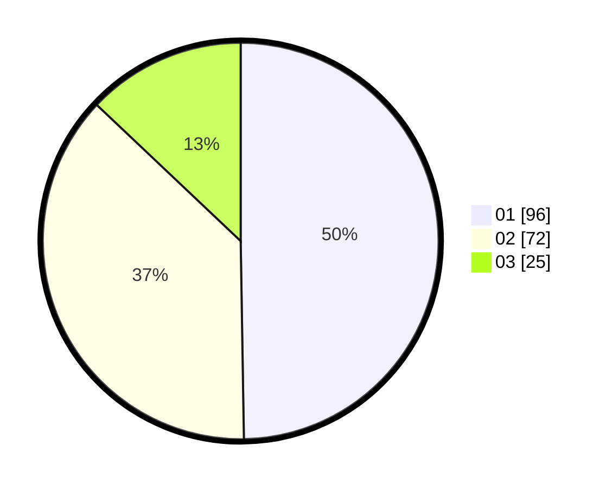

# Hasil

Hasil perolehan suara paslon dapat dilihat pada file paslon-01.txt, paslon-02.txt, dan paslon-03.txt.

Jika tidak ada, artinya data tersebut belum ada pada SIREKAP.

## Perolehan Suara

 * Paslon 01: **96**.
 * Paslon 02: **72**.
 * Paslon 03: **25**.

## Foto C Plano

https://sirekap-obj-formc.kpu.go.id/ce2d/pemilu/ppwp/31/74/08/10/01/3174081001040-20240217-185244--c32ccebe-5ace-43b4-8da3-f997d4da5733.jpg

https://sirekap-obj-formc.kpu.go.id/ce2d/pemilu/ppwp/31/74/08/10/01/3174081001040-20240217-202205--85c90d4f-a5bd-4a74-b9bc-01116ebe1ebd.jpg

https://sirekap-obj-formc.kpu.go.id/ce2d/pemilu/ppwp/31/74/08/10/01/3174081001040-20240217-202526--15331200-aa46-4c01-bc3b-64e857a79dee.jpg

## DATA PEMILIH TETAP

Jumlah pemilih dalam DPT: **231**.
 * L: **114**.
 * P: **117**.

## DATA PENGGUNA HAK PILIH

Jumlah pengguna hak pilih dalam DPT: **190**.
 * L: **93**.
 * P: **97**.

Jumlah pengguna hak pilih dalam DPTb: **0**.
 * L: **0**.
 * P: **0**.

Jumlah pengguna hak pilih dalam DPK: **4**.
 * L: **3**.
 * P: **1**.

Jumlah pengguna hak pilih: **194**.
 * L: **96**.
 * P: **98**.

## JUMLAH SUARA SAH DAN TIDAK SAH

JUMLAH SELURUH SUARA SAH: **193**.

JUMLAH SUARA TIDAK SAH: **1**.

JUMLAH SELURUH SUARA SAH DAN SUARA TIDAK SAH: **194**.
