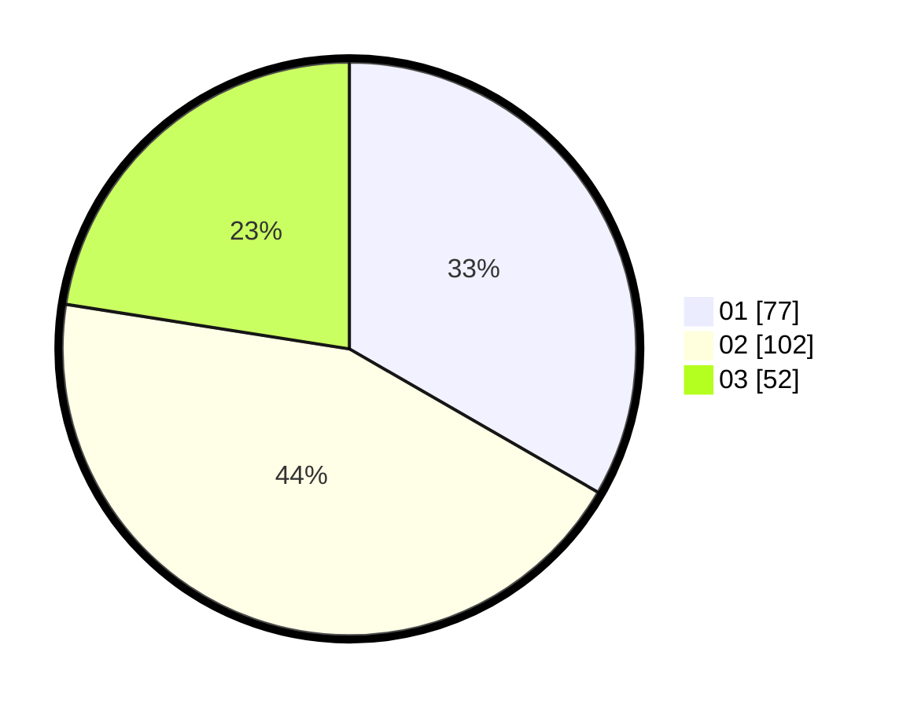

# Hasil

Hasil perolehan suara paslon dapat dilihat pada file paslon-01.txt, paslon-02.txt, dan paslon-03.txt.

Jika tidak ada, artinya data tersebut belum ada pada SIREKAP.

## Perolehan Suara

 * Paslon 01: **77**.
 * Paslon 02: **102**.
 * Paslon 03: **52**.

## Foto C Plano

https://sirekap-obj-formc.kpu.go.id/37c6/pemilu/ppwp/31/74/08/10/01/3174081001045-20240218-072026--c8742745-7c83-4231-8575-3aef15f5ee71.jpg

https://sirekap-obj-formc.kpu.go.id/37c6/pemilu/ppwp/31/74/08/10/01/3174081001045-20240218-073530--9e7fc348-4b98-4608-bd51-ae267cad94ad.jpg

https://sirekap-obj-formc.kpu.go.id/37c6/pemilu/ppwp/31/74/08/10/01/3174081001045-20240218-073742--fac11fab-9637-43f8-a3f9-b3e0a9d41b18.jpg

## DATA PEMILIH TETAP

Jumlah pemilih dalam DPT: **286**.
 * L: **123**.
 * P: **163**.

## DATA PENGGUNA HAK PILIH

Jumlah pengguna hak pilih dalam DPT: **206**.
 * L: **82**.
 * P: **124**.

Jumlah pengguna hak pilih dalam DPTb: **12**.
 * L: **7**.
 * P: **5**.

Jumlah pengguna hak pilih dalam DPK: **13**.
 * L: **7**.
 * P: **6**.

Jumlah pengguna hak pilih: **231**.
 * L: **96**.
 * P: **135**.

## JUMLAH SUARA SAH DAN TIDAK SAH

JUMLAH SELURUH SUARA SAH: **231**.

JUMLAH SUARA TIDAK SAH: **0**.

JUMLAH SELURUH SUARA SAH DAN SUARA TIDAK SAH: **231**.
