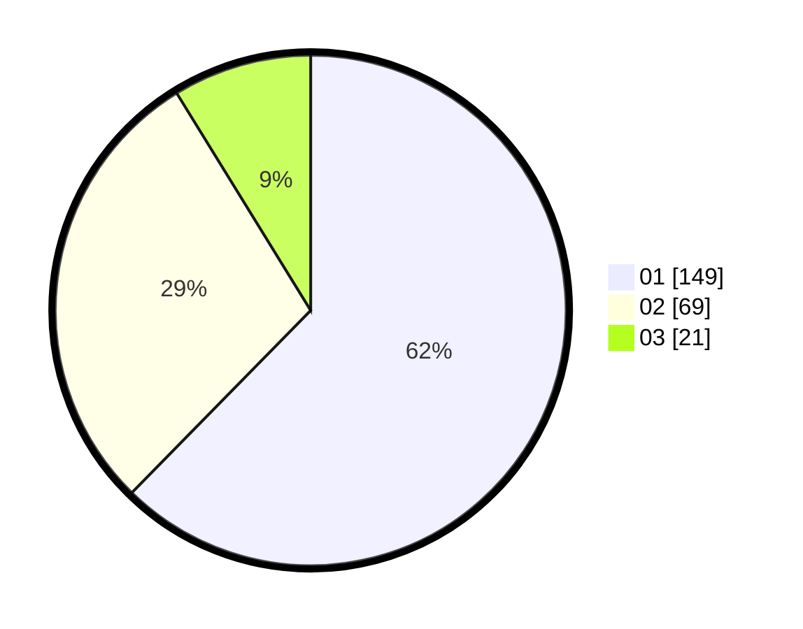

# Hasil

Hasil perolehan suara paslon dapat dilihat pada file paslon-01.txt, paslon-02.txt, dan paslon-03.txt.

Jika tidak ada, artinya data tersebut belum ada pada SIREKAP.

## Perolehan Suara

 * Paslon 01: **149**.
 * Paslon 02: **69**.
 * Paslon 03: **21**.

## Foto C Plano

https://sirekap-obj-formc.kpu.go.id/b1f2/pemilu/ppwp/31/74/08/10/01/3174081001049-20240218-102600--d2f902ee-bbf1-4fa9-b77f-4eb2f6bec5b5.jpg

https://sirekap-obj-formc.kpu.go.id/b1f2/pemilu/ppwp/31/74/08/10/01/3174081001049-20240218-103412--de17015c-95dd-4f90-8207-a97ef0e810bc.jpg

https://sirekap-obj-formc.kpu.go.id/b1f2/pemilu/ppwp/31/74/08/10/01/3174081001049-20240218-104103--794457d4-fe7c-4ff9-8d33-708a0f0d41bc.jpg

## DATA PEMILIH TETAP

Jumlah pemilih dalam DPT: **285**.
 * L: **139**.
 * P: **146**.

## DATA PENGGUNA HAK PILIH

Jumlah pengguna hak pilih dalam DPT: **234**.
 * L: **112**.
 * P: **122**.

Jumlah pengguna hak pilih dalam DPTb: **7**.
 * L: **2**.
 * P: **5**.

Jumlah pengguna hak pilih dalam DPK: **0**.
 * L: **0**.
 * P: **0**.

Jumlah pengguna hak pilih: **241**.
 * L: **114**.
 * P: **127**.

## JUMLAH SUARA SAH DAN TIDAK SAH

JUMLAH SELURUH SUARA SAH: **239**.

JUMLAH SUARA TIDAK SAH: **2**.

JUMLAH SELURUH SUARA SAH DAN SUARA TIDAK SAH: **241**.
