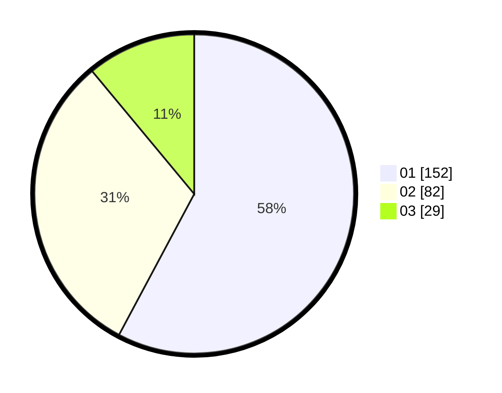

# Hasil

Hasil perolehan suara paslon dapat dilihat pada file paslon-01.txt, paslon-02.txt, dan paslon-03.txt.

Jika tidak ada, artinya data tersebut belum ada pada SIREKAP.

## Perolehan Suara

 * Paslon 01: **152**.
 * Paslon 02: **82**.
 * Paslon 03: **29**.

## Foto C Plano

https://sirekap-obj-formc.kpu.go.id/f669/pemilu/ppwp/31/74/08/10/01/3174081001050-20240217-180618--7de36229-cb34-492b-bebd-a2e4e45dcc23.jpg

https://sirekap-obj-formc.kpu.go.id/f669/pemilu/ppwp/31/74/08/10/01/3174081001050-20240217-180827--fcdeb76b-47f1-4446-bf2d-5a97b749bf55.jpg

https://sirekap-obj-formc.kpu.go.id/f669/pemilu/ppwp/31/74/08/10/01/3174081001050-20240217-181001--5668e822-0342-4ff0-808a-ae823da5509a.jpg

## DATA PEMILIH TETAP

Jumlah pemilih dalam DPT: **297**.
 * L: **139**.
 * P: **158**.

## DATA PENGGUNA HAK PILIH

Jumlah pengguna hak pilih dalam DPT: **251**.
 * L: **118**.
 * P: **133**.

Jumlah pengguna hak pilih dalam DPTb: **11**.
 * L: **3**.
 * P: **8**.

Jumlah pengguna hak pilih dalam DPK: **2**.
 * L: **2**.
 * P: **0**.

Jumlah pengguna hak pilih: **264**.
 * L: **123**.
 * P: **141**.

## JUMLAH SUARA SAH DAN TIDAK SAH

JUMLAH SELURUH SUARA SAH: **263**.

JUMLAH SUARA TIDAK SAH: **1**.

JUMLAH SELURUH SUARA SAH DAN SUARA TIDAK SAH: **264**.
