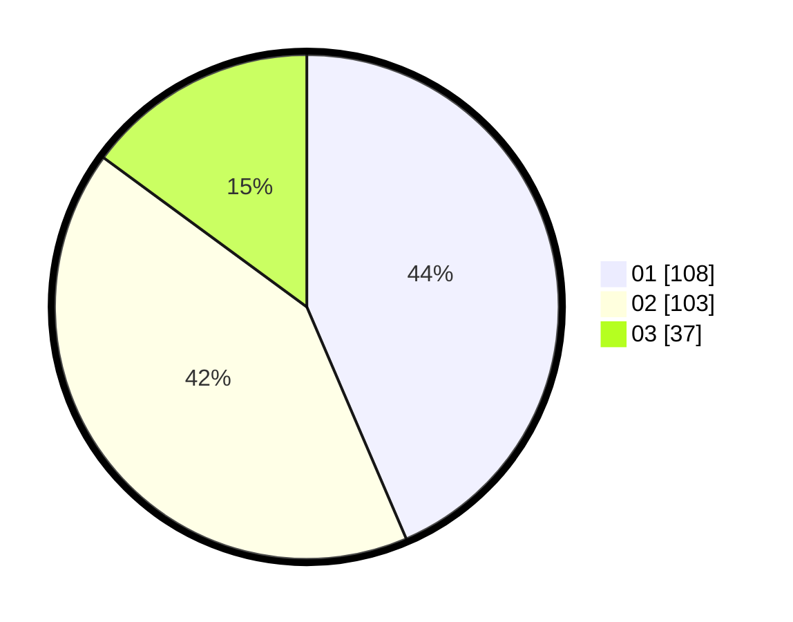

# Hasil

Hasil perolehan suara paslon dapat dilihat pada file paslon-01.txt, paslon-02.txt, dan paslon-03.txt.

Jika tidak ada, artinya data tersebut belum ada pada SIREKAP.

## Perolehan Suara

 * Paslon 01: **108**.
 * Paslon 02: **103**.
 * Paslon 03: **37**.

## Foto C Plano

https://sirekap-obj-formc.kpu.go.id/cf7e/pemilu/ppwp/31/74/08/10/01/3174081001051-20240217-170237--9e6fc873-4e2c-4add-9c05-f3a0c78cae25.jpg

https://sirekap-obj-formc.kpu.go.id/cf7e/pemilu/ppwp/31/74/08/10/01/3174081001051-20240217-170908--d9349ce0-a982-44cb-98ed-54c1998f5692.jpg

https://sirekap-obj-formc.kpu.go.id/cf7e/pemilu/ppwp/31/74/08/10/01/3174081001051-20240217-171155--e06f05d3-51d7-44fd-bdb2-029d298a4074.jpg

## DATA PEMILIH TETAP

Jumlah pemilih dalam DPT: **295**.
 * L: **143**.
 * P: **152**.

## DATA PENGGUNA HAK PILIH

Jumlah pengguna hak pilih dalam DPT: **240**.
 * L: **114**.
 * P: **126**.

Jumlah pengguna hak pilih dalam DPTb: **9**.
 * L: **4**.
 * P: **5**.

Jumlah pengguna hak pilih dalam DPK: **0**.
 * L: **0**.
 * P: **0**.

Jumlah pengguna hak pilih: **249**.
 * L: **118**.
 * P: **131**.

## JUMLAH SUARA SAH DAN TIDAK SAH

JUMLAH SELURUH SUARA SAH: **248**.

JUMLAH SUARA TIDAK SAH: **1**.

JUMLAH SELURUH SUARA SAH DAN SUARA TIDAK SAH: **249**.
