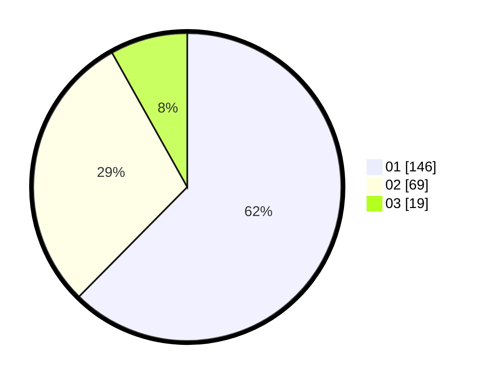

# Hasil

Hasil perolehan suara paslon dapat dilihat pada file paslon-01.txt, paslon-02.txt, dan paslon-03.txt.

Jika tidak ada, artinya data tersebut belum ada pada SIREKAP.

## Perolehan Suara

 * Paslon 01: **146**.
 * Paslon 02: **69**.
 * Paslon 03: **19**.

## Foto C Plano

https://sirekap-obj-formc.kpu.go.id/0fbc/pemilu/ppwp/31/74/08/10/01/3174081001053-20240217-203958--bf52d72c-42a7-4546-8169-1cadd668c4c1.jpg

https://sirekap-obj-formc.kpu.go.id/0fbc/pemilu/ppwp/31/74/08/10/01/3174081001053-20240217-203745--a07be3b2-cf85-4331-a701-1037f916ade2.jpg

https://sirekap-obj-formc.kpu.go.id/0fbc/pemilu/ppwp/31/74/08/10/01/3174081001053-20240217-203852--de475d2a-3767-4328-9ce6-3630cdfb2ca1.jpg

## DATA PEMILIH TETAP

Jumlah pemilih dalam DPT: **271**.
 * L: **128**.
 * P: **143**.

## DATA PENGGUNA HAK PILIH

Jumlah pengguna hak pilih dalam DPT: **221**.
 * L: **103**.
 * P: **118**.

Jumlah pengguna hak pilih dalam DPTb: **12**.
 * L: **6**.
 * P: **6**.

Jumlah pengguna hak pilih dalam DPK: **3**.
 * L: **2**.
 * P: **1**.

Jumlah pengguna hak pilih: **236**.
 * L: **111**.
 * P: **125**.

## JUMLAH SUARA SAH DAN TIDAK SAH

JUMLAH SELURUH SUARA SAH: **234**.

JUMLAH SUARA TIDAK SAH: **2**.

JUMLAH SELURUH SUARA SAH DAN SUARA TIDAK SAH: **236**.
