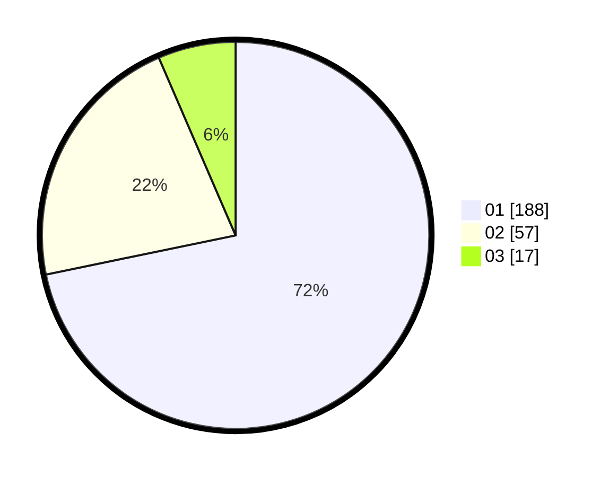

# Hasil

Hasil perolehan suara paslon dapat dilihat pada file paslon-01.txt, paslon-02.txt, dan paslon-03.txt.

Jika tidak ada, artinya data tersebut belum ada pada SIREKAP.

## Perolehan Suara

 * Paslon 01: **188**.
 * Paslon 02: **57**.
 * Paslon 03: **17**.

## Foto C Plano

https://sirekap-obj-formc.kpu.go.id/e8d1/pemilu/ppwp/31/74/08/10/01/3174081001055-20240217-161744--a8b19848-0fb6-4c7c-9617-f3b1768927be.jpg

https://sirekap-obj-formc.kpu.go.id/e8d1/pemilu/ppwp/31/74/08/10/01/3174081001055-20240217-162102--cbc060e7-4a9c-4fc1-9b0f-f8ed9fb1e367.jpg

https://sirekap-obj-formc.kpu.go.id/e8d1/pemilu/ppwp/31/74/08/10/01/3174081001055-20240217-163341--4b8cee1f-f850-4f1b-be7d-3577daa36d42.jpg

## DATA PEMILIH TETAP

Jumlah pemilih dalam DPT: **269**.
 * L: **139**.
 * P: **130**.

## DATA PENGGUNA HAK PILIH

Jumlah pengguna hak pilih dalam DPT: **245**.
 * L: **128**.
 * P: **117**.

Jumlah pengguna hak pilih dalam DPTb: **14**.
 * L: **3**.
 * P: **11**.

Jumlah pengguna hak pilih dalam DPK: **3**.
 * L: **2**.
 * P: **1**.

Jumlah pengguna hak pilih: **262**.
 * L: **133**.
 * P: **129**.

## JUMLAH SUARA SAH DAN TIDAK SAH

JUMLAH SELURUH SUARA SAH: **262**.

JUMLAH SUARA TIDAK SAH: **0**.

JUMLAH SELURUH SUARA SAH DAN SUARA TIDAK SAH: **262**.
