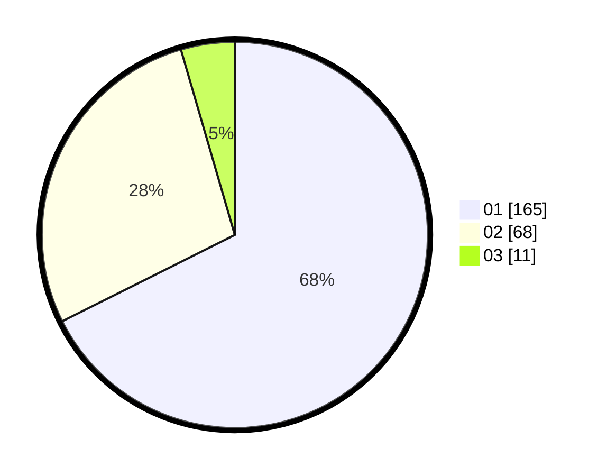

# Hasil

Hasil perolehan suara paslon dapat dilihat pada file paslon-01.txt, paslon-02.txt, dan paslon-03.txt.

Jika tidak ada, artinya data tersebut belum ada pada SIREKAP.

## Perolehan Suara

 * Paslon 01: **165**.
 * Paslon 02: **68**.
 * Paslon 03: **11**.

## Foto C Plano

https://sirekap-obj-formc.kpu.go.id/9c05/pemilu/ppwp/31/74/08/10/01/3174081001063-20240217-205634--8252a801-0a8e-45ad-a7ce-d549a0f8b0c5.jpg

https://sirekap-obj-formc.kpu.go.id/9c05/pemilu/ppwp/31/74/08/10/01/3174081001063-20240214-231315--d2075ed2-fba2-4a96-89d4-6935da67fec8.jpg

https://sirekap-obj-formc.kpu.go.id/9c05/pemilu/ppwp/31/74/08/10/01/3174081001063-20240214-231417--eaf08129-a6d2-4373-ac06-d6bfe972ef26.jpg

## DATA PEMILIH TETAP

Jumlah pemilih dalam DPT: **286**.
 * L: **138**.
 * P: **148**.

## DATA PENGGUNA HAK PILIH

Jumlah pengguna hak pilih dalam DPT: **246**.
 * L: **113**.
 * P: **133**.

Jumlah pengguna hak pilih dalam DPTb: **2**.
 * L: **1**.
 * P: **1**.

Jumlah pengguna hak pilih dalam DPK: **1**.
 * L: **0**.
 * P: **1**.

Jumlah pengguna hak pilih: **249**.
 * L: **114**.
 * P: **135**.

## JUMLAH SUARA SAH DAN TIDAK SAH

JUMLAH SELURUH SUARA SAH: **244**.

JUMLAH SUARA TIDAK SAH: **5**.

JUMLAH SELURUH SUARA SAH DAN SUARA TIDAK SAH: **249**.
