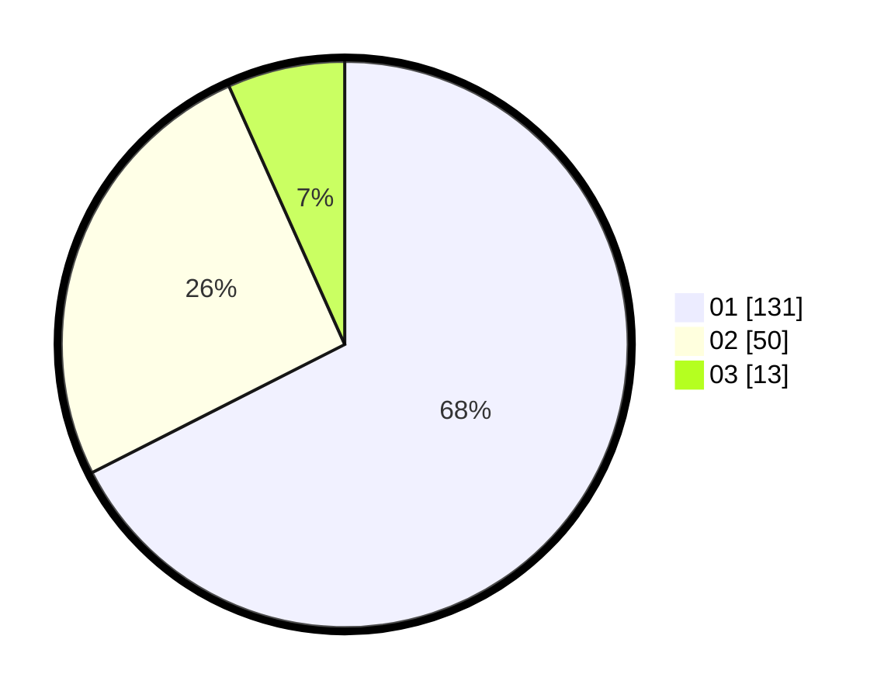

# Hasil

Hasil perolehan suara paslon dapat dilihat pada file paslon-01.txt, paslon-02.txt, dan paslon-03.txt.

Jika tidak ada, artinya data tersebut belum ada pada SIREKAP.

## Perolehan Suara

 * Paslon 01: **131**.
 * Paslon 02: **50**.
 * Paslon 03: **13**.

## Foto C Plano

https://sirekap-obj-formc.kpu.go.id/1c90/pemilu/ppwp/31/74/08/10/01/3174081001064-20240214-160115--f22cf353-4b2b-4fd1-b557-6943661c13c9.jpg

https://sirekap-obj-formc.kpu.go.id/1c90/pemilu/ppwp/31/74/08/10/01/3174081001064-20240214-160147--b8270a2c-3a48-4fd7-8509-678ff9c188c7.jpg

https://sirekap-obj-formc.kpu.go.id/1c90/pemilu/ppwp/31/74/08/10/01/3174081001064-20240217-234136--8c18c6f9-c026-4e8b-895e-f351d92bc137.jpg

## DATA PEMILIH TETAP

Jumlah pemilih dalam DPT: **281**.
 * L: **150**.
 * P: **131**.

## DATA PENGGUNA HAK PILIH

Jumlah pengguna hak pilih dalam DPT: **191**.
 * L: **94**.
 * P: **97**.

Jumlah pengguna hak pilih dalam DPTb: **5**.
 * L: **1**.
 * P: **4**.

Jumlah pengguna hak pilih dalam DPK: **0**.
 * L: **0**.
 * P: **0**.

Jumlah pengguna hak pilih: **196**.
 * L: **95**.
 * P: **101**.

## JUMLAH SUARA SAH DAN TIDAK SAH

JUMLAH SELURUH SUARA SAH: **194**.

JUMLAH SUARA TIDAK SAH: **2**.

JUMLAH SELURUH SUARA SAH DAN SUARA TIDAK SAH: **196**.
