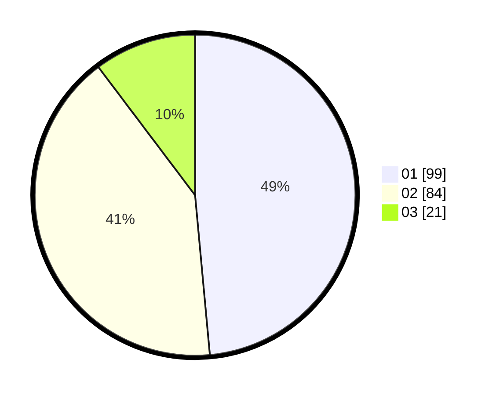

# Hasil

Hasil perolehan suara paslon dapat dilihat pada file paslon-01.txt, paslon-02.txt, dan paslon-03.txt.

Jika tidak ada, artinya data tersebut belum ada pada SIREKAP.

## Perolehan Suara

 * Paslon 01: **99**.
 * Paslon 02: **84**.
 * Paslon 03: **21**.

## Foto C Plano

https://sirekap-obj-formc.kpu.go.id/737f/pemilu/ppwp/31/74/08/10/01/3174081001065-20240217-165928--5b31cbd6-fc18-4c2b-9475-3c7009eaf4d1.jpg

https://sirekap-obj-formc.kpu.go.id/737f/pemilu/ppwp/31/74/08/10/01/3174081001065-20240217-170221--64e2ed0e-3f60-4531-bdf1-7bce3de74409.jpg

https://sirekap-obj-formc.kpu.go.id/737f/pemilu/ppwp/31/74/08/10/01/3174081001065-20240217-170511--391a5b68-7b40-483a-ace0-e67c1240069c.jpg

## DATA PEMILIH TETAP

Jumlah pemilih dalam DPT: **259**.
 * L: **127**.
 * P: **132**.

## DATA PENGGUNA HAK PILIH

Jumlah pengguna hak pilih dalam DPT: **203**.
 * L: **102**.
 * P: **101**.

Jumlah pengguna hak pilih dalam DPTb: **1**.
 * L: **0**.
 * P: **1**.

Jumlah pengguna hak pilih dalam DPK: **3**.
 * L: **3**.
 * P: **0**.

Jumlah pengguna hak pilih: **207**.
 * L: **105**.
 * P: **102**.

## JUMLAH SUARA SAH DAN TIDAK SAH

JUMLAH SELURUH SUARA SAH: **204**.

JUMLAH SUARA TIDAK SAH: **3**.

JUMLAH SELURUH SUARA SAH DAN SUARA TIDAK SAH: **207**.
