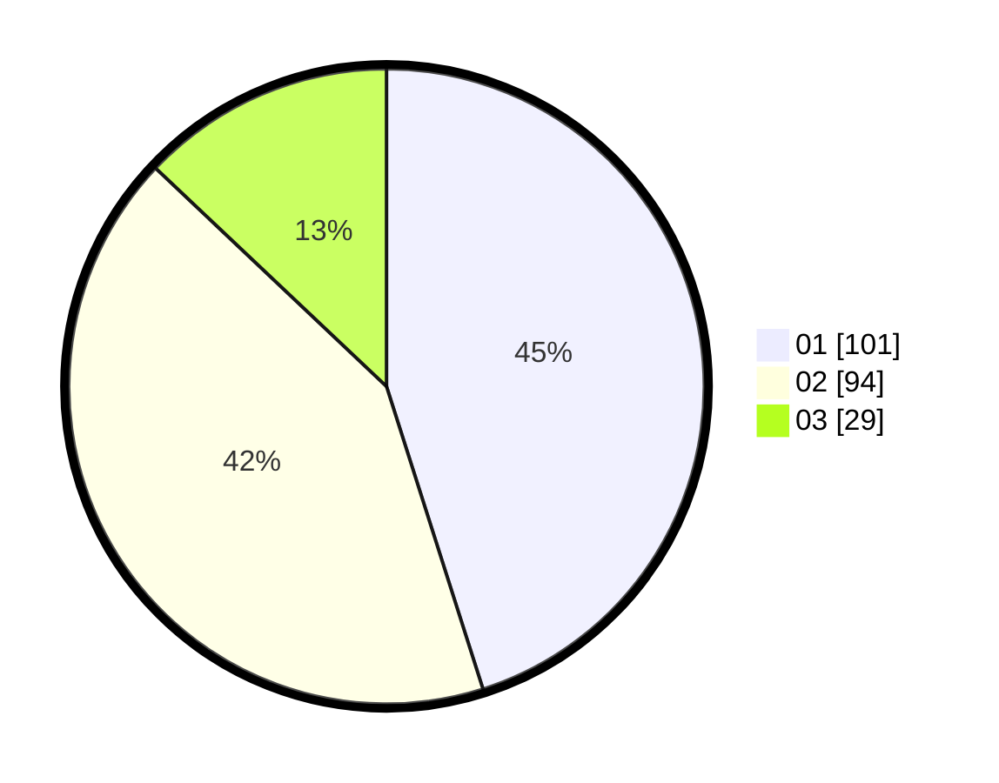

# Hasil

Hasil perolehan suara paslon dapat dilihat pada file paslon-01.txt, paslon-02.txt, dan paslon-03.txt.

Jika tidak ada, artinya data tersebut belum ada pada SIREKAP.

## Perolehan Suara

 * Paslon 01: **101**.
 * Paslon 02: **94**.
 * Paslon 03: **29**.

## Foto C Plano

https://sirekap-obj-formc.kpu.go.id/5a44/pemilu/ppwp/31/74/08/10/01/3174081001066-20240217-165849--0d22a258-723d-45eb-98fa-d90f3f950010.jpg

https://sirekap-obj-formc.kpu.go.id/5a44/pemilu/ppwp/31/74/08/10/01/3174081001066-20240217-170059--5406c748-b8e5-4bbf-8260-9d541c0b829f.jpg

https://sirekap-obj-formc.kpu.go.id/5a44/pemilu/ppwp/31/74/08/10/01/3174081001066-20240217-170204--a8c7060e-0dbc-4352-94ee-a040cfb8787d.jpg

## DATA PEMILIH TETAP

Jumlah pemilih dalam DPT: **260**.
 * L: **127**.
 * P: **133**.

## DATA PENGGUNA HAK PILIH

Jumlah pengguna hak pilih dalam DPT: **223**.
 * L: **104**.
 * P: **119**.

Jumlah pengguna hak pilih dalam DPTb: **1**.
 * L: **0**.
 * P: **1**.

Jumlah pengguna hak pilih dalam DPK: **4**.
 * L: **1**.
 * P: **3**.

Jumlah pengguna hak pilih: **228**.
 * L: **105**.
 * P: **123**.

## JUMLAH SUARA SAH DAN TIDAK SAH

JUMLAH SELURUH SUARA SAH: **224**.

JUMLAH SUARA TIDAK SAH: **4**.

JUMLAH SELURUH SUARA SAH DAN SUARA TIDAK SAH: **228**.
