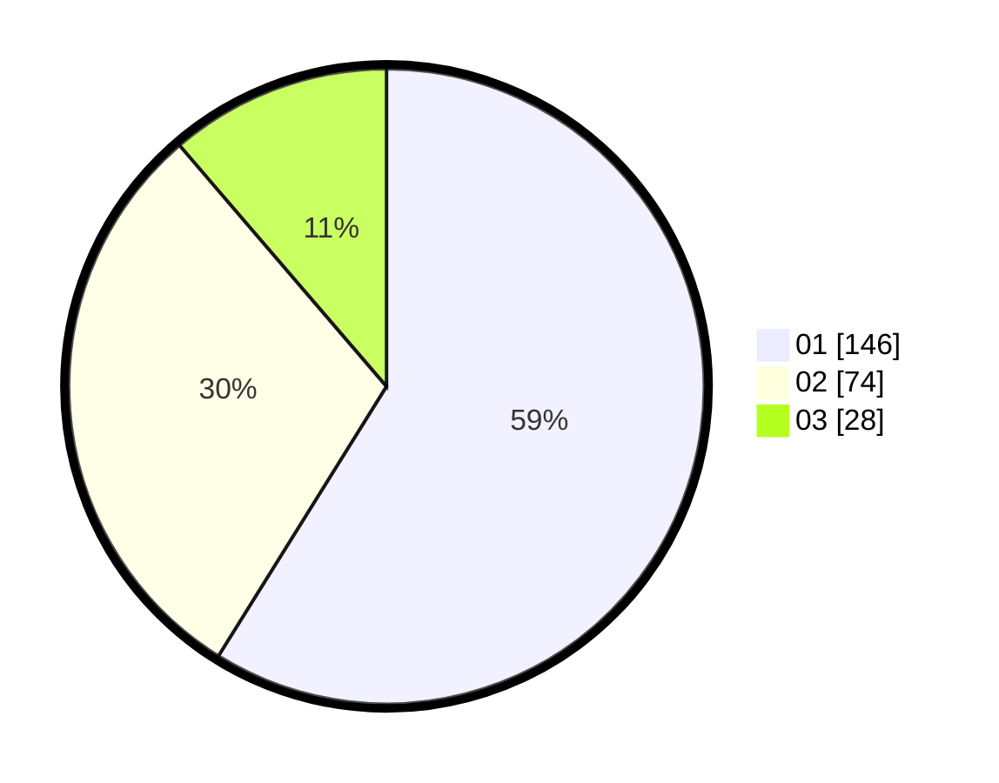

# Hasil

Hasil perolehan suara paslon dapat dilihat pada file paslon-01.txt, paslon-02.txt, dan paslon-03.txt.

Jika tidak ada, artinya data tersebut belum ada pada SIREKAP.

## Perolehan Suara

 * Paslon 01: **146**.
 * Paslon 02: **74**.
 * Paslon 03: **28**.

## Foto C Plano

https://sirekap-obj-formc.kpu.go.id/bd07/pemilu/ppwp/31/74/08/10/01/3174081001067-20240218-190226--a1f79b3e-cc64-432b-bb6f-61655a15cdb2.jpg

https://sirekap-obj-formc.kpu.go.id/bd07/pemilu/ppwp/31/74/08/10/01/3174081001067-20240218-150956--e2c13186-0fae-458d-9f55-c3976ae55b04.jpg

https://sirekap-obj-formc.kpu.go.id/bd07/pemilu/ppwp/31/74/08/10/01/3174081001067-20240218-151051--c220ac48-5fd2-4f47-b830-9287e28d5f11.jpg

## DATA PEMILIH TETAP

Jumlah pemilih dalam DPT: **252**.
 * L: **128**.
 * P: **134**.

## DATA PENGGUNA HAK PILIH

Jumlah pengguna hak pilih dalam DPT: **289**.
 * L: **142**.
 * P: **147**.

Jumlah pengguna hak pilih dalam DPTb: **8**.
 * L: **3**.
 * P: **5**.

Jumlah pengguna hak pilih dalam DPK: **0**.
 * L: **0**.
 * P: **0**.

Jumlah pengguna hak pilih: **297**.
 * L: **747**.
 * P: **152**.

## JUMLAH SUARA SAH DAN TIDAK SAH

JUMLAH SELURUH SUARA SAH: **248**.

JUMLAH SUARA TIDAK SAH: **4**.

JUMLAH SELURUH SUARA SAH DAN SUARA TIDAK SAH: **252**.
