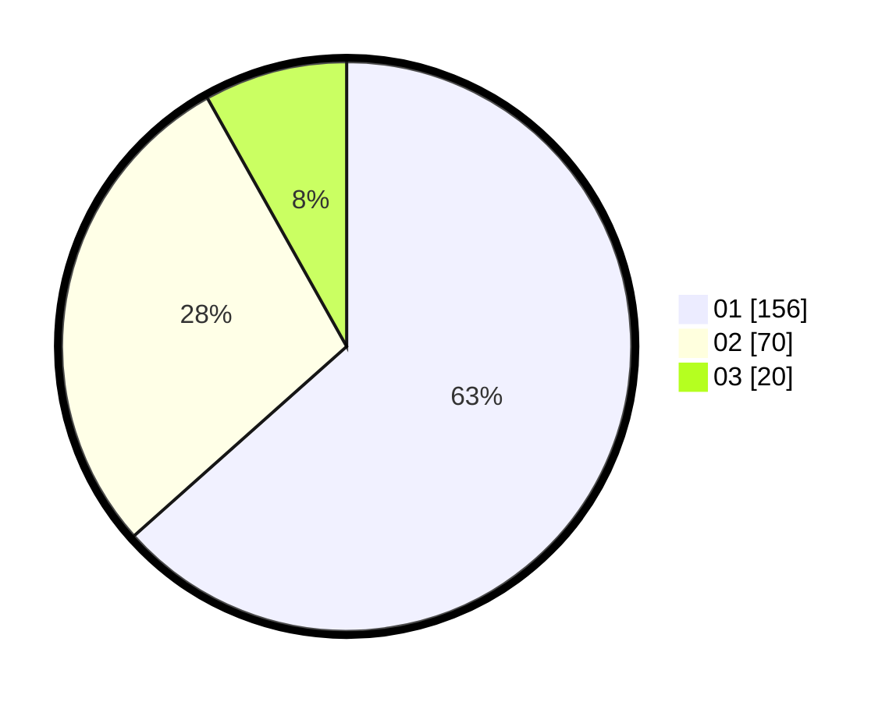

# Hasil

Hasil perolehan suara paslon dapat dilihat pada file paslon-01.txt, paslon-02.txt, dan paslon-03.txt.

Jika tidak ada, artinya data tersebut belum ada pada SIREKAP.

## Perolehan Suara

 * Paslon 01: **156**.
 * Paslon 02: **70**.
 * Paslon 03: **20**.

## Foto C Plano

https://sirekap-obj-formc.kpu.go.id/957e/pemilu/ppwp/31/74/08/10/01/3174081001068-20240214-194411--f83578b4-e6e4-4de5-981b-5506bd18492c.jpg

https://sirekap-obj-formc.kpu.go.id/957e/pemilu/ppwp/31/74/08/10/01/3174081001068-20240214-194503--c1e3cd95-110a-4711-ab2e-cc161b934245.jpg

https://sirekap-obj-formc.kpu.go.id/957e/pemilu/ppwp/31/74/08/10/01/3174081001068-20240214-194713--009de10f-f6c5-45d8-bbce-1bb6c14d8867.jpg

## DATA PEMILIH TETAP

Jumlah pemilih dalam DPT: **283**.
 * L: **152**.
 * P: **131**.

## DATA PENGGUNA HAK PILIH

Jumlah pengguna hak pilih dalam DPT: **244**.
 * L: **128**.
 * P: **116**.

Jumlah pengguna hak pilih dalam DPTb: **3**.
 * L: **0**.
 * P: **3**.

Jumlah pengguna hak pilih dalam DPK: **0**.
 * L: **0**.
 * P: **0**.

Jumlah pengguna hak pilih: **247**.
 * L: **128**.
 * P: **119**.

## JUMLAH SUARA SAH DAN TIDAK SAH

JUMLAH SELURUH SUARA SAH: **246**.

JUMLAH SUARA TIDAK SAH: **1**.

JUMLAH SELURUH SUARA SAH DAN SUARA TIDAK SAH: **247**.
