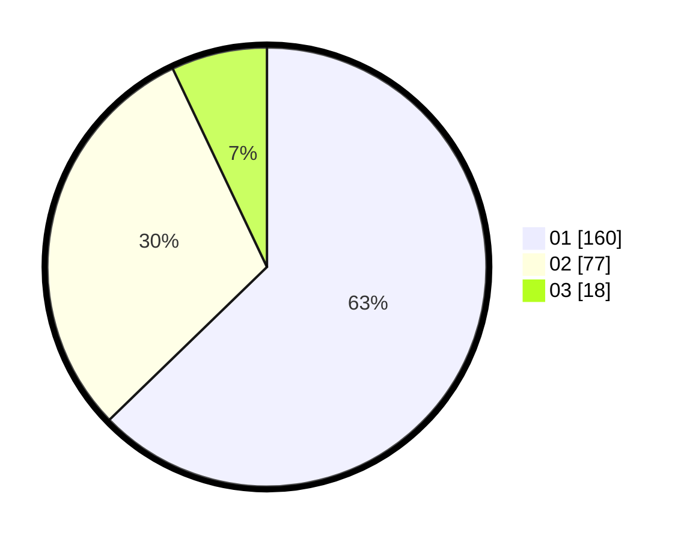

# Hasil

Hasil perolehan suara paslon dapat dilihat pada file paslon-01.txt, paslon-02.txt, dan paslon-03.txt.

Jika tidak ada, artinya data tersebut belum ada pada SIREKAP.

## Perolehan Suara

 * Paslon 01: **160**.
 * Paslon 02: **77**.
 * Paslon 03: **18**.

## Foto C Plano

https://sirekap-obj-formc.kpu.go.id/01b5/pemilu/ppwp/31/74/08/10/01/3174081001069-20240218-133209--9d7ee7a6-5c4e-40de-b417-52c139523a2d.jpg

https://sirekap-obj-formc.kpu.go.id/01b5/pemilu/ppwp/31/74/08/10/01/3174081001069-20240218-133211--3b438731-e1cd-4c27-9c44-5fb340b9de1d.jpg

https://sirekap-obj-formc.kpu.go.id/01b5/pemilu/ppwp/31/74/08/10/01/3174081001069-20240218-133210--73afac86-7fd6-420d-b38c-f8bc6ebd6e02.jpg

## DATA PEMILIH TETAP

Jumlah pemilih dalam DPT: **296**.
 * L: **142**.
 * P: **154**.

## DATA PENGGUNA HAK PILIH

Jumlah pengguna hak pilih dalam DPT: **254**.
 * L: **119**.
 * P: **135**.

Jumlah pengguna hak pilih dalam DPTb: **2**.
 * L: **0**.
 * P: **2**.

Jumlah pengguna hak pilih dalam DPK: **2**.
 * L: **2**.
 * P: **0**.

Jumlah pengguna hak pilih: **258**.
 * L: **121**.
 * P: **137**.

## JUMLAH SUARA SAH DAN TIDAK SAH

JUMLAH SELURUH SUARA SAH: **255**.

JUMLAH SUARA TIDAK SAH: **3**.

JUMLAH SELURUH SUARA SAH DAN SUARA TIDAK SAH: **258**.
