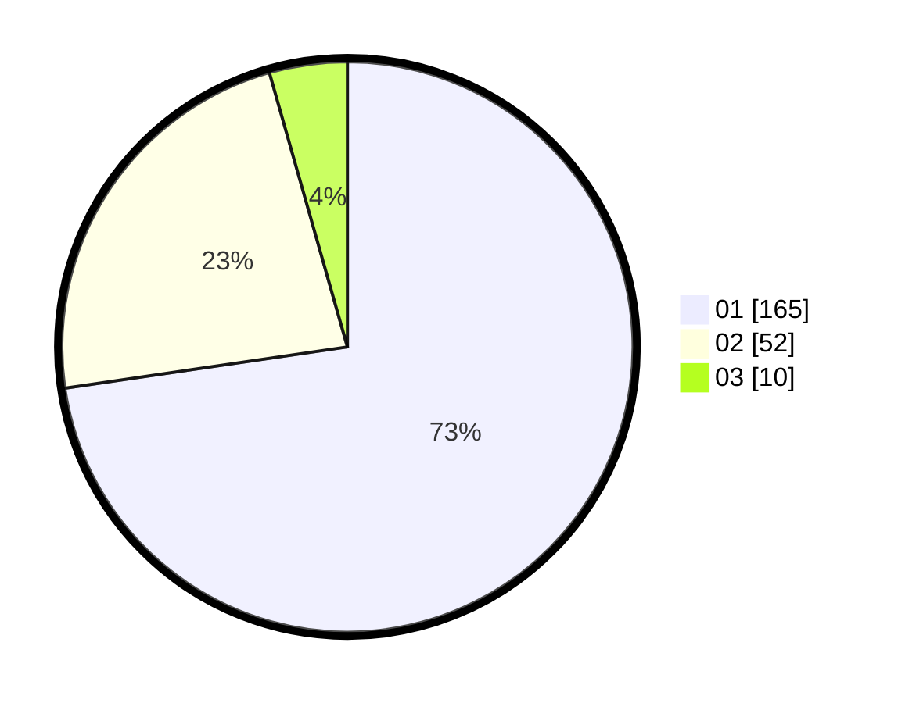

# Hasil

Hasil perolehan suara paslon dapat dilihat pada file paslon-01.txt, paslon-02.txt, dan paslon-03.txt.

Jika tidak ada, artinya data tersebut belum ada pada SIREKAP.

## Perolehan Suara

 * Paslon 01: **165**.
 * Paslon 02: **52**.
 * Paslon 03: **10**.

## Foto C Plano

https://sirekap-obj-formc.kpu.go.id/6a9f/pemilu/ppwp/31/74/08/10/01/3174081001070-20240218-205155--9539854d-8182-49ac-a7dc-f9c02bd4e657.jpg

https://sirekap-obj-formc.kpu.go.id/6a9f/pemilu/ppwp/31/74/08/10/01/3174081001070-20240218-211210--77c5caad-10a8-4d1b-aa75-03b8b259aa4c.jpg

https://sirekap-obj-formc.kpu.go.id/6a9f/pemilu/ppwp/31/74/08/10/01/3174081001070-20240218-212108--b700319d-c0ff-445d-8af0-f48e5b4de1fc.jpg

## DATA PEMILIH TETAP

Jumlah pemilih dalam DPT: **279**.
 * L: **143**.
 * P: **136**.

## DATA PENGGUNA HAK PILIH

Jumlah pengguna hak pilih dalam DPT: **222**.
 * L: **115**.
 * P: **107**.

Jumlah pengguna hak pilih dalam DPTb: **4**.
 * L: **4**.
 * P: **0**.

Jumlah pengguna hak pilih dalam DPK: **2**.
 * L: **1**.
 * P: **1**.

Jumlah pengguna hak pilih: **228**.
 * L: **120**.
 * P: **108**.

## JUMLAH SUARA SAH DAN TIDAK SAH

JUMLAH SELURUH SUARA SAH: **227**.

JUMLAH SUARA TIDAK SAH: **1**.

JUMLAH SELURUH SUARA SAH DAN SUARA TIDAK SAH: **228**.
