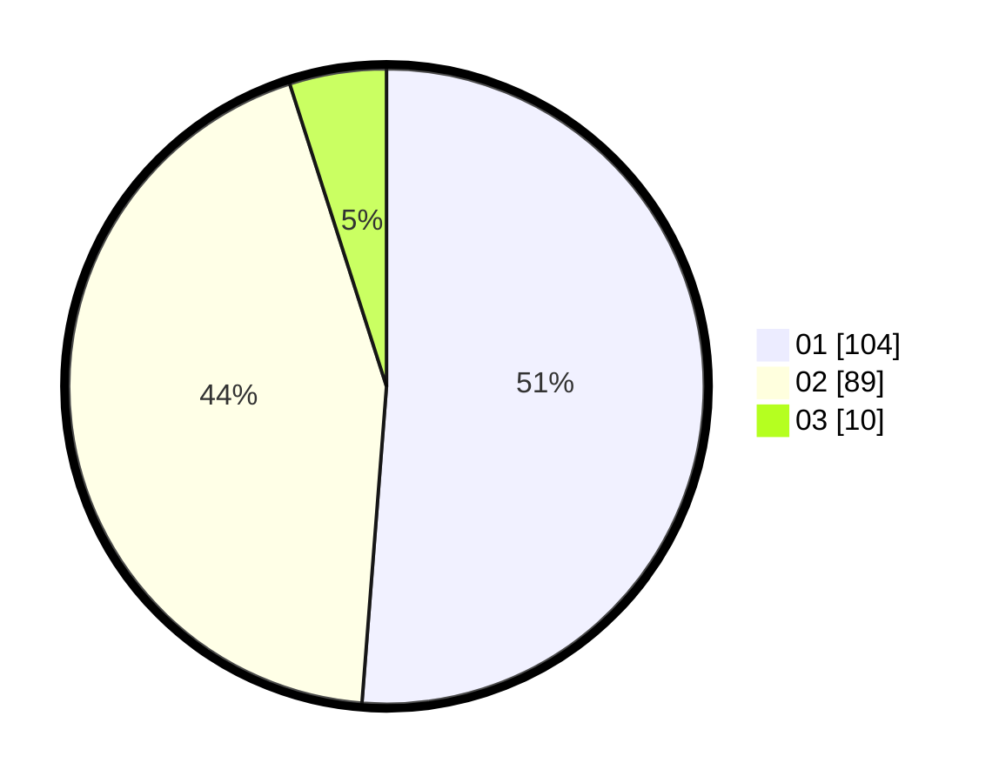

# Hasil

Hasil perolehan suara paslon dapat dilihat pada file paslon-01.txt, paslon-02.txt, dan paslon-03.txt.

Jika tidak ada, artinya data tersebut belum ada pada SIREKAP.

## Perolehan Suara

 * Paslon 01: **104**.
 * Paslon 02: **89**.
 * Paslon 03: **10**.

## Foto C Plano

https://sirekap-obj-formc.kpu.go.id/26b9/pemilu/ppwp/31/74/08/10/02/3174081002002-20240216-185700--9ddd90a0-fe2e-4fec-8928-55d4c66552c7.jpg

https://sirekap-obj-formc.kpu.go.id/26b9/pemilu/ppwp/31/74/08/10/02/3174081002002-20240216-185811--271daca3-931e-4550-8dc2-9655cd8352b5.jpg

https://sirekap-obj-formc.kpu.go.id/26b9/pemilu/ppwp/31/74/08/10/02/3174081002002-20240216-185910--8e1c02d3-10d7-450b-8b51-ae16f72080ce.jpg

## DATA PEMILIH TETAP

Jumlah pemilih dalam DPT: **251**.
 * L: **122**.
 * P: **129**.

## DATA PENGGUNA HAK PILIH

Jumlah pengguna hak pilih dalam DPT: **196**.
 * L: **91**.
 * P: **105**.

Jumlah pengguna hak pilih dalam DPTb: **4**.
 * L: **2**.
 * P: **2**.

Jumlah pengguna hak pilih dalam DPK: **6**.
 * L: **3**.
 * P: **3**.

Jumlah pengguna hak pilih: **206**.
 * L: **96**.
 * P: **110**.

## JUMLAH SUARA SAH DAN TIDAK SAH

JUMLAH SELURUH SUARA SAH: **203**.

JUMLAH SUARA TIDAK SAH: **3**.

JUMLAH SELURUH SUARA SAH DAN SUARA TIDAK SAH: **206**.
