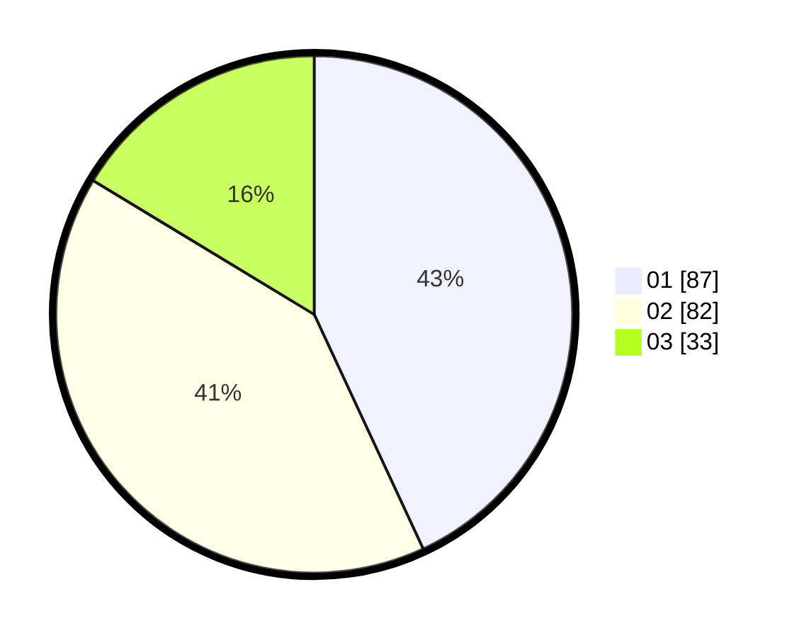

# Hasil

Hasil perolehan suara paslon dapat dilihat pada file paslon-01.txt, paslon-02.txt, dan paslon-03.txt.

Jika tidak ada, artinya data tersebut belum ada pada SIREKAP.

## Perolehan Suara

 * Paslon 01: **87**.
 * Paslon 02: **82**.
 * Paslon 03: **33**.

## Foto C Plano

https://sirekap-obj-formc.kpu.go.id/f5e4/pemilu/ppwp/31/74/08/10/02/3174081002004-20240214-193347--10ebd3dc-7071-4e04-acd1-a4ffe86a3454.jpg

https://sirekap-obj-formc.kpu.go.id/f5e4/pemilu/ppwp/31/74/08/10/02/3174081002004-20240214-141823--3c756013-07d7-4d42-a43b-07ab36625a5d.jpg

https://sirekap-obj-formc.kpu.go.id/f5e4/pemilu/ppwp/31/74/08/10/02/3174081002004-20240214-193350--ca95ceba-161b-4d5c-87d9-b27b5220339d.jpg

## DATA PEMILIH TETAP

Jumlah pemilih dalam DPT: **210**.
 * L: **99**.
 * P: **111**.

## DATA PENGGUNA HAK PILIH

Jumlah pengguna hak pilih dalam DPT: **185**.
 * L: **86**.
 * P: **99**.

Jumlah pengguna hak pilih dalam DPTb: **16**.
 * L: **5**.
 * P: **11**.

Jumlah pengguna hak pilih dalam DPK: **2**.
 * L: **0**.
 * P: **2**.

Jumlah pengguna hak pilih: **203**.
 * L: **91**.
 * P: **112**.

## JUMLAH SUARA SAH DAN TIDAK SAH

JUMLAH SELURUH SUARA SAH: **202**.

JUMLAH SUARA TIDAK SAH: **1**.

JUMLAH SELURUH SUARA SAH DAN SUARA TIDAK SAH: **203**.
