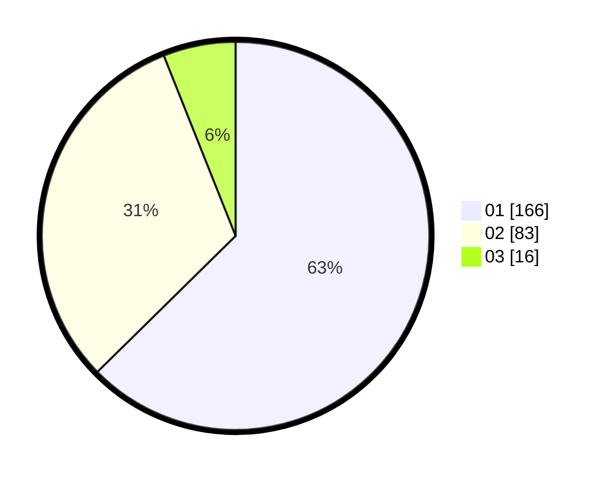

# Hasil

Hasil perolehan suara paslon dapat dilihat pada file paslon-01.txt, paslon-02.txt, dan paslon-03.txt.

Jika tidak ada, artinya data tersebut belum ada pada SIREKAP.

## Perolehan Suara

 * Paslon 01: **166**.
 * Paslon 02: **83**.
 * Paslon 03: **16**.

## Foto C Plano

https://sirekap-obj-formc.kpu.go.id/e7d3/pemilu/ppwp/31/74/08/10/02/3174081002015-20240214-155622--34c7e65b-845e-4daf-90b9-adfed665004b.jpg

https://sirekap-obj-formc.kpu.go.id/e7d3/pemilu/ppwp/31/74/08/10/02/3174081002015-20240214-155514--647c325a-9c81-4a06-89f9-4c33a941a9f0.jpg

https://sirekap-obj-formc.kpu.go.id/e7d3/pemilu/ppwp/31/74/08/10/02/3174081002015-20240214-155432--e78e5dcc-4f41-4ccf-b14c-468109665d41.jpg

## DATA PEMILIH TETAP

Jumlah pemilih dalam DPT: **296**.
 * L: **149**.
 * P: **147**.

## DATA PENGGUNA HAK PILIH

Jumlah pengguna hak pilih dalam DPT: **262**.
 * L: **134**.
 * P: **128**.

Jumlah pengguna hak pilih dalam DPTb: **2**.
 * L: **0**.
 * P: **2**.

Jumlah pengguna hak pilih dalam DPK: **3**.
 * L: **0**.
 * P: **3**.

Jumlah pengguna hak pilih: **267**.
 * L: **134**.
 * P: **133**.

## JUMLAH SUARA SAH DAN TIDAK SAH

JUMLAH SELURUH SUARA SAH: **265**.

JUMLAH SUARA TIDAK SAH: **2**.

JUMLAH SELURUH SUARA SAH DAN SUARA TIDAK SAH: **267**.
