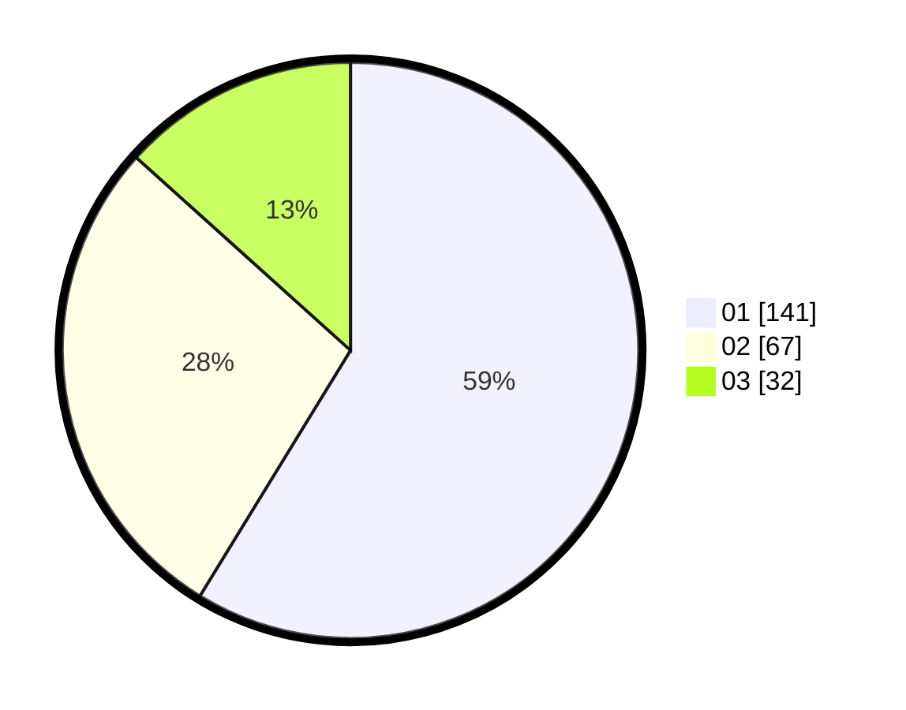

# Hasil

Hasil perolehan suara paslon dapat dilihat pada file paslon-01.txt, paslon-02.txt, dan paslon-03.txt.

Jika tidak ada, artinya data tersebut belum ada pada SIREKAP.

## Perolehan Suara

 * Paslon 01: **141**.
 * Paslon 02: **67**.
 * Paslon 03: **32**.

## Foto C Plano

https://sirekap-obj-formc.kpu.go.id/854c/pemilu/ppwp/31/74/08/10/02/3174081002018-20240214-190903--ccbe5aca-72c7-49b3-b541-6f021df3b98b.jpg

https://sirekap-obj-formc.kpu.go.id/854c/pemilu/ppwp/31/74/08/10/02/3174081002018-20240214-192532--02a736d0-f2a0-45cf-b278-e391080eb7ad.jpg

https://sirekap-obj-formc.kpu.go.id/854c/pemilu/ppwp/31/74/08/10/02/3174081002018-20240214-191248--2537f4c4-1042-4cd9-88b1-23790934357b.jpg

## DATA PEMILIH TETAP

Jumlah pemilih dalam DPT: **277**.
 * L: **139**.
 * P: **138**.

## DATA PENGGUNA HAK PILIH

Jumlah pengguna hak pilih dalam DPT: **239**.
 * L: **114**.
 * P: **125**.

Jumlah pengguna hak pilih dalam DPTb: **2**.
 * L: **2**.
 * P: **0**.

Jumlah pengguna hak pilih dalam DPK: **1**.
 * L: **1**.
 * P: **0**.

Jumlah pengguna hak pilih: **242**.
 * L: **117**.
 * P: **125**.

## JUMLAH SUARA SAH DAN TIDAK SAH

JUMLAH SELURUH SUARA SAH: **240**.

JUMLAH SUARA TIDAK SAH: **2**.

JUMLAH SELURUH SUARA SAH DAN SUARA TIDAK SAH: **242**.
