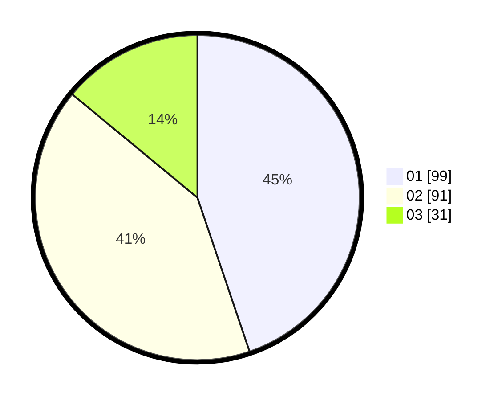

# Hasil

Hasil perolehan suara paslon dapat dilihat pada file paslon-01.txt, paslon-02.txt, dan paslon-03.txt.

Jika tidak ada, artinya data tersebut belum ada pada SIREKAP.

## Perolehan Suara

 * Paslon 01: **99**.
 * Paslon 02: **91**.
 * Paslon 03: **31**.

## Foto C Plano

https://sirekap-obj-formc.kpu.go.id/36b7/pemilu/ppwp/31/74/08/10/02/3174081002019-20240215-010504--53401935-0352-49e7-b6b2-2daa3f963a45.jpg

https://sirekap-obj-formc.kpu.go.id/36b7/pemilu/ppwp/31/74/08/10/02/3174081002019-20240215-010603--089547f1-9580-4e35-96b7-8d636f34e3ea.jpg

https://sirekap-obj-formc.kpu.go.id/36b7/pemilu/ppwp/31/74/08/10/02/3174081002019-20240215-213900--54c11628-f6e4-43f9-bfe4-32da1b81928b.jpg

## DATA PEMILIH TETAP

Jumlah pemilih dalam DPT: **300**.
 * L: **155**.
 * P: **145**.

## DATA PENGGUNA HAK PILIH

Jumlah pengguna hak pilih dalam DPT: **212**.
 * L: **96**.
 * P: **116**.

Jumlah pengguna hak pilih dalam DPTb: **1**.
 * L: **0**.
 * P: **1**.

Jumlah pengguna hak pilih dalam DPK: **8**.
 * L: **3**.
 * P: **5**.

Jumlah pengguna hak pilih: **221**.
 * L: **99**.
 * P: **122**.

## JUMLAH SUARA SAH DAN TIDAK SAH

JUMLAH SELURUH SUARA SAH: **221**.

JUMLAH SUARA TIDAK SAH: **0**.

JUMLAH SELURUH SUARA SAH DAN SUARA TIDAK SAH: **221**.
