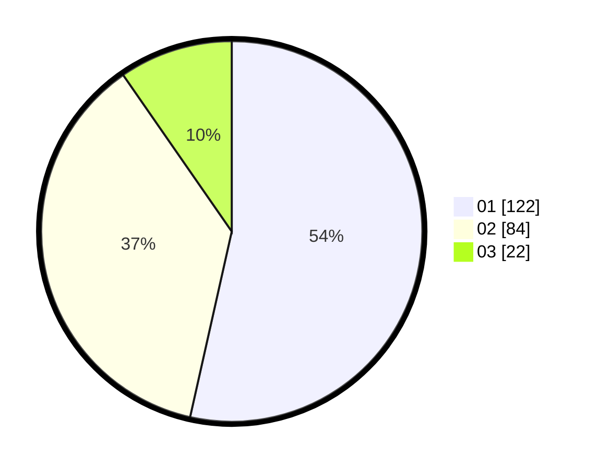

# Hasil

Hasil perolehan suara paslon dapat dilihat pada file paslon-01.txt, paslon-02.txt, dan paslon-03.txt.

Jika tidak ada, artinya data tersebut belum ada pada SIREKAP.

## Perolehan Suara

 * Paslon 01: **122**.
 * Paslon 02: **84**.
 * Paslon 03: **22**.

## Foto C Plano

https://sirekap-obj-formc.kpu.go.id/cc32/pemilu/ppwp/31/74/08/10/02/3174081002025-20240214-202818--0f8199ed-7d96-4fd1-8182-6969b0231b90.jpg

https://sirekap-obj-formc.kpu.go.id/cc32/pemilu/ppwp/31/74/08/10/02/3174081002025-20240214-202943--70264957-8339-4973-b82c-c05d706a691e.jpg

https://sirekap-obj-formc.kpu.go.id/cc32/pemilu/ppwp/31/74/08/10/02/3174081002025-20240214-203449--1f37e996-f7a8-431a-b36d-1e440af62ced.jpg

## DATA PEMILIH TETAP

Jumlah pemilih dalam DPT: **268**.
 * L: **141**.
 * P: **127**.

## DATA PENGGUNA HAK PILIH

Jumlah pengguna hak pilih dalam DPT: **226**.
 * L: **116**.
 * P: **110**.

Jumlah pengguna hak pilih dalam DPTb: **3**.
 * L: **1**.
 * P: **2**.

Jumlah pengguna hak pilih dalam DPK: **2**.
 * L: **1**.
 * P: **1**.

Jumlah pengguna hak pilih: **231**.
 * L: **118**.
 * P: **113**.

## JUMLAH SUARA SAH DAN TIDAK SAH

JUMLAH SELURUH SUARA SAH: **228**.

JUMLAH SUARA TIDAK SAH: **3**.

JUMLAH SELURUH SUARA SAH DAN SUARA TIDAK SAH: **231**.
