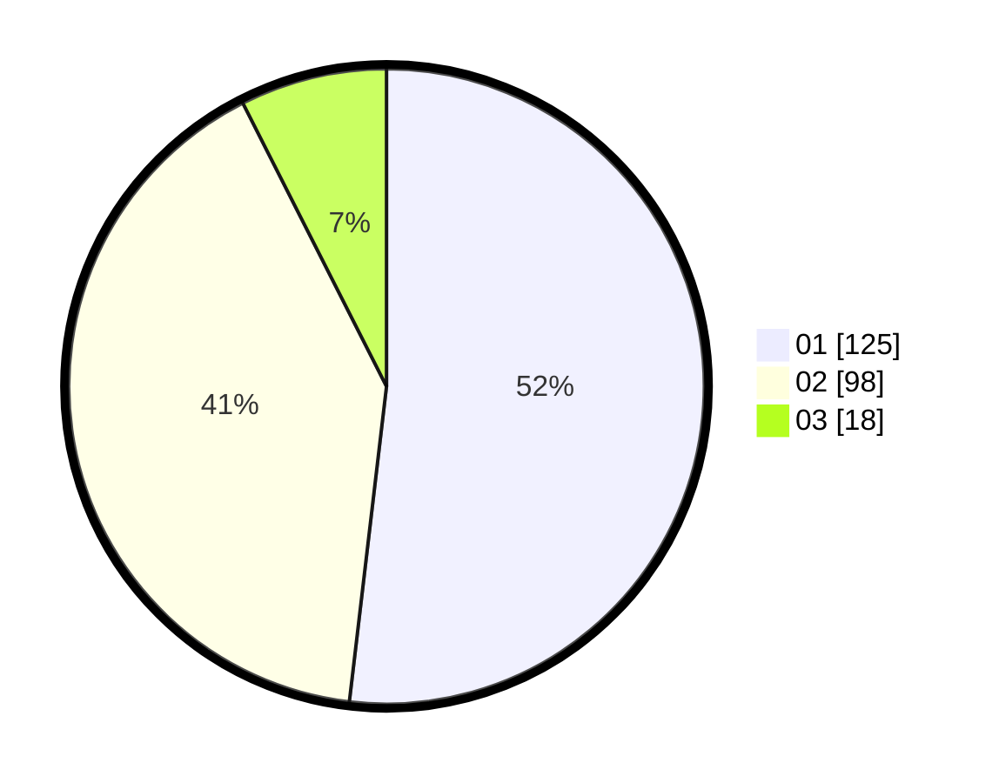

# Hasil

Hasil perolehan suara paslon dapat dilihat pada file paslon-01.txt, paslon-02.txt, dan paslon-03.txt.

Jika tidak ada, artinya data tersebut belum ada pada SIREKAP.

## Perolehan Suara

 * Paslon 01: **125**.
 * Paslon 02: **98**.
 * Paslon 03: **18**.

## Foto C Plano

https://sirekap-obj-formc.kpu.go.id/ad38/pemilu/ppwp/31/74/08/10/02/3174081002026-20240214-205129--1cad21c2-3c77-4f7e-ba42-fd96dc8c5a2d.jpg

https://sirekap-obj-formc.kpu.go.id/ad38/pemilu/ppwp/31/74/08/10/02/3174081002026-20240214-205309--145aa547-44a2-43c8-a9a0-d371278f20a7.jpg

https://sirekap-obj-formc.kpu.go.id/ad38/pemilu/ppwp/31/74/08/10/02/3174081002026-20240214-205356--7e656853-1af7-4274-9b00-84b65cba41a1.jpg

## DATA PEMILIH TETAP

Jumlah pemilih dalam DPT: **285**.
 * L: **146**.
 * P: **139**.

## DATA PENGGUNA HAK PILIH

Jumlah pengguna hak pilih dalam DPT: **239**.
 * L: **118**.
 * P: **121**.

Jumlah pengguna hak pilih dalam DPTb: **3**.
 * L: **1**.
 * P: **2**.

Jumlah pengguna hak pilih dalam DPK: **1**.
 * L: **0**.
 * P: **1**.

Jumlah pengguna hak pilih: **243**.
 * L: **119**.
 * P: **124**.

## JUMLAH SUARA SAH DAN TIDAK SAH

JUMLAH SELURUH SUARA SAH: **241**.

JUMLAH SUARA TIDAK SAH: **2**.

JUMLAH SELURUH SUARA SAH DAN SUARA TIDAK SAH: **243**.
