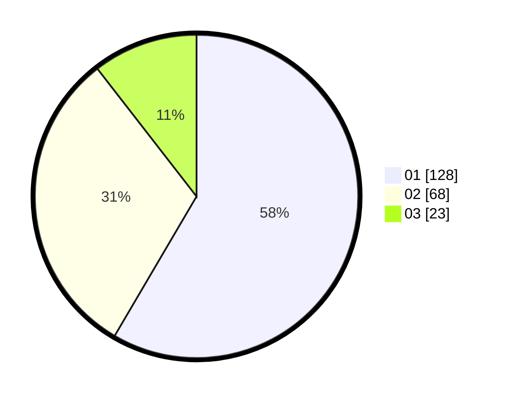

# Hasil

Hasil perolehan suara paslon dapat dilihat pada file paslon-01.txt, paslon-02.txt, dan paslon-03.txt.

Jika tidak ada, artinya data tersebut belum ada pada SIREKAP.

## Perolehan Suara

 * Paslon 01: **128**.
 * Paslon 02: **68**.
 * Paslon 03: **23**.

## Foto C Plano

https://sirekap-obj-formc.kpu.go.id/8997/pemilu/ppwp/31/74/08/10/02/3174081002029-20240219-073553--5d0f53c8-149b-4bef-acb3-8c39f968823f.jpg

https://sirekap-obj-formc.kpu.go.id/8997/pemilu/ppwp/31/74/08/10/02/3174081002029-20240219-074529--4e001a37-509f-4f2a-abe8-486f2598dbad.jpg

https://sirekap-obj-formc.kpu.go.id/8997/pemilu/ppwp/31/74/08/10/02/3174081002029-20240219-075139--6360504b-ce84-45c5-b35d-f0c98843351b.jpg

## DATA PEMILIH TETAP

Jumlah pemilih dalam DPT: **278**.
 * L: **138**.
 * P: **140**.

## DATA PENGGUNA HAK PILIH

Jumlah pengguna hak pilih dalam DPT: **214**.
 * L: **105**.
 * P: **109**.

Jumlah pengguna hak pilih dalam DPTb: **3**.
 * L: **0**.
 * P: **3**.

Jumlah pengguna hak pilih dalam DPK: **4**.
 * L: **2**.
 * P: **2**.

Jumlah pengguna hak pilih: **221**.
 * L: **107**.
 * P: **114**.

## JUMLAH SUARA SAH DAN TIDAK SAH

JUMLAH SELURUH SUARA SAH: **219**.

JUMLAH SUARA TIDAK SAH: **2**.

JUMLAH SELURUH SUARA SAH DAN SUARA TIDAK SAH: **221**.
