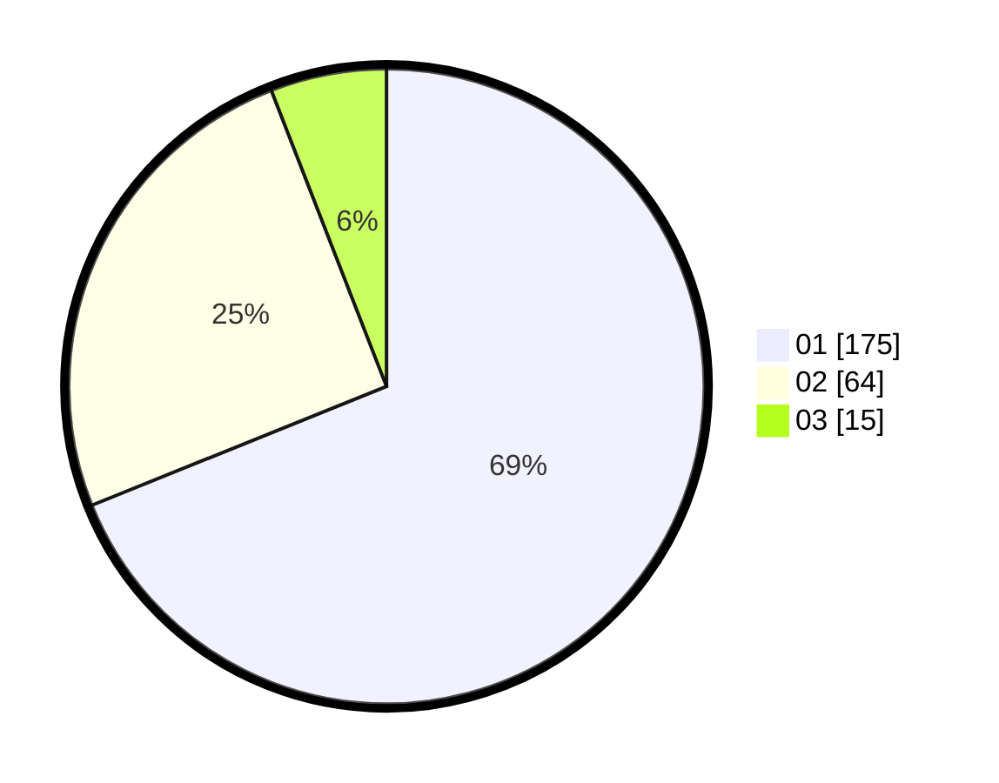

# Hasil

Hasil perolehan suara paslon dapat dilihat pada file paslon-01.txt, paslon-02.txt, dan paslon-03.txt.

Jika tidak ada, artinya data tersebut belum ada pada SIREKAP.

## Perolehan Suara

 * Paslon 01: **175**.
 * Paslon 02: **64**.
 * Paslon 03: **15**.

## Foto C Plano

https://sirekap-obj-formc.kpu.go.id/2716/pemilu/ppwp/31/74/08/10/02/3174081002032-20240214-155027--7e7eff48-1e97-436c-a73f-5a9e1e206012.jpg

https://sirekap-obj-formc.kpu.go.id/2716/pemilu/ppwp/31/74/08/10/02/3174081002032-20240214-155147--45d8eedf-fb86-4628-9927-262a00c50217.jpg

https://sirekap-obj-formc.kpu.go.id/2716/pemilu/ppwp/31/74/08/10/02/3174081002032-20240214-155153--55d002b0-1d25-4f7e-852b-7f1bee7c8d59.jpg

## DATA PEMILIH TETAP

Jumlah pemilih dalam DPT: **295**.
 * L: **153**.
 * P: **142**.

## DATA PENGGUNA HAK PILIH

Jumlah pengguna hak pilih dalam DPT: **254**.
 * L: **130**.
 * P: **124**.

Jumlah pengguna hak pilih dalam DPTb: **0**.
 * L: **0**.
 * P: **0**.

Jumlah pengguna hak pilih dalam DPK: **1**.
 * L: **1**.
 * P: **0**.

Jumlah pengguna hak pilih: **255**.
 * L: **131**.
 * P: **124**.

## JUMLAH SUARA SAH DAN TIDAK SAH

JUMLAH SELURUH SUARA SAH: **254**.

JUMLAH SUARA TIDAK SAH: **1**.

JUMLAH SELURUH SUARA SAH DAN SUARA TIDAK SAH: **255**.
