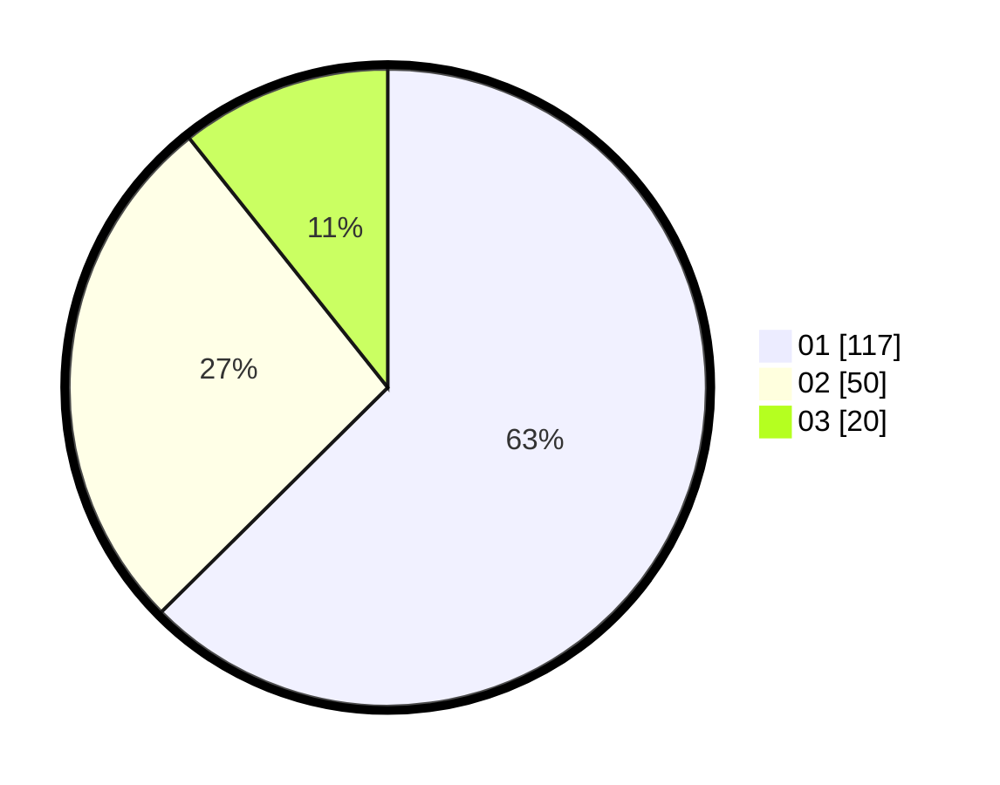

# Hasil

Hasil perolehan suara paslon dapat dilihat pada file paslon-01.txt, paslon-02.txt, dan paslon-03.txt.

Jika tidak ada, artinya data tersebut belum ada pada SIREKAP.

## Perolehan Suara

 * Paslon 01: **117**.
 * Paslon 02: **50**.
 * Paslon 03: **20**.

## Foto C Plano

https://sirekap-obj-formc.kpu.go.id/218b/pemilu/ppwp/31/74/08/10/02/3174081002036-20240214-200159--07e07f1c-c554-4c74-bcd7-8887555e4f7e.jpg

https://sirekap-obj-formc.kpu.go.id/218b/pemilu/ppwp/31/74/08/10/02/3174081002036-20240214-210436--9fe1f933-89f0-46b5-9600-dd0e30bebe69.jpg

https://sirekap-obj-formc.kpu.go.id/218b/pemilu/ppwp/31/74/08/10/02/3174081002036-20240218-154705--d9a1b9c3-4fbb-4f42-91cc-510aca1e3fc3.jpg

## DATA PEMILIH TETAP

Jumlah pemilih dalam DPT: **209**.
 * L: **100**.
 * P: **109**.

## DATA PENGGUNA HAK PILIH

Jumlah pengguna hak pilih dalam DPT: **173**.
 * L: **83**.
 * P: **90**.

Jumlah pengguna hak pilih dalam DPTb: **15**.
 * L: **7**.
 * P: **8**.

Jumlah pengguna hak pilih dalam DPK: **1**.
 * L: **0**.
 * P: **1**.

Jumlah pengguna hak pilih: **189**.
 * L: **90**.
 * P: **99**.

## JUMLAH SUARA SAH DAN TIDAK SAH

JUMLAH SELURUH SUARA SAH: **187**.

JUMLAH SUARA TIDAK SAH: **2**.

JUMLAH SELURUH SUARA SAH DAN SUARA TIDAK SAH: **189**.
