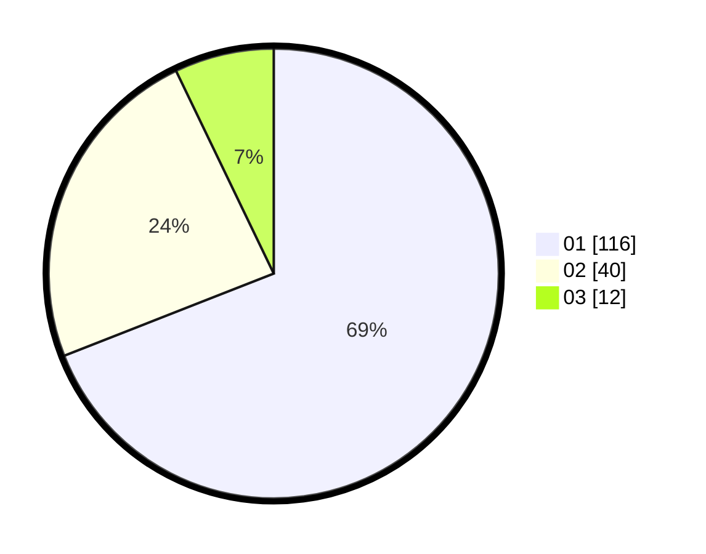

# Hasil

Hasil perolehan suara paslon dapat dilihat pada file paslon-01.txt, paslon-02.txt, dan paslon-03.txt.

Jika tidak ada, artinya data tersebut belum ada pada SIREKAP.

## Perolehan Suara

 * Paslon 01: **116**.
 * Paslon 02: **40**.
 * Paslon 03: **12**.

## Foto C Plano

https://sirekap-obj-formc.kpu.go.id/1207/pemilu/ppwp/31/74/08/10/02/3174081002039-20240215-130253--ee9c75ae-fb0d-4817-9ae4-5fddaf9d5564.jpg

https://sirekap-obj-formc.kpu.go.id/1207/pemilu/ppwp/31/74/08/10/02/3174081002039-20240215-155447--e84da4d5-1fea-4637-9a0d-01adbf16b3c5.jpg

https://sirekap-obj-formc.kpu.go.id/1207/pemilu/ppwp/31/74/08/10/02/3174081002039-20240214-230037--a8fd0612-f35b-40c7-849c-d6af04e868cf.jpg

## DATA PEMILIH TETAP

Jumlah pemilih dalam DPT: **222**.
 * L: **113**.
 * P: **109**.

## DATA PENGGUNA HAK PILIH

Jumlah pengguna hak pilih dalam DPT: **164**.
 * L: **80**.
 * P: **84**.

Jumlah pengguna hak pilih dalam DPTb: **2**.
 * L: **1**.
 * P: **1**.

Jumlah pengguna hak pilih dalam DPK: **4**.
 * L: **2**.
 * P: **2**.

Jumlah pengguna hak pilih: **170**.
 * L: **83**.
 * P: **87**.

## JUMLAH SUARA SAH DAN TIDAK SAH

JUMLAH SELURUH SUARA SAH: **170**.

JUMLAH SUARA TIDAK SAH: **2**.

JUMLAH SELURUH SUARA SAH DAN SUARA TIDAK SAH: **170**.
